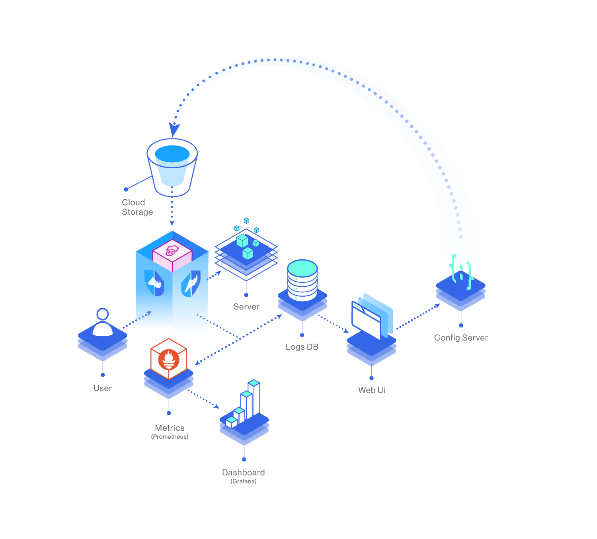
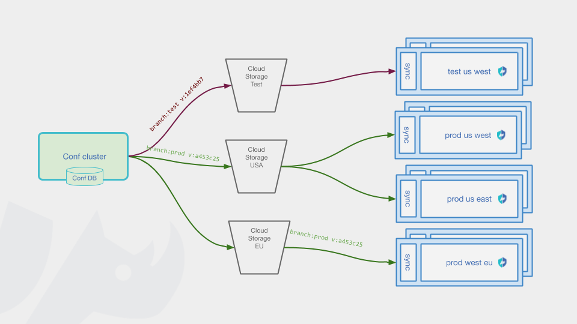

# Overview

Curiefense is an **API-first, DevOps oriented web-defense HTTP-Filter** **adapter for** [**Envoy**](https://www.envoyproxy.io/) **and** [**NGINX**](https://nginx.org/en/). It provides multiple security technologies \(WAF, application-layer DDoS protection, bot management, and more\) along with real-time traffic monitoring and transparency.

Curiefense is [fully controllable programmatically](settings/api/). All configuration data \(security rulesets, policies, etc.\) can be maintained singularly, or as different branches for different environments, as you choose. All changes are versioned, and reverts can be done at any time.

Curiefense also has a UI console, discussed in this Manual beginning in the [Settings](settings/policies-rules/) section. 

## Version

This documentation is for **version 1.4.0.**

\(To view docs for a different version, choose it at the top of the left sidebar.\)

## Architecture and Components

Curiefense provides traffic filtering that can be configured differently for multiple environments \(e.g. dev/qa/prod\), all of which can be administered from one central cluster if desired. Here is an overview of its components.

In the diagram above, the **Server** represents a resource protected by Curiefense \(a site, app, service, or API\). The **User** is a traffic source attempting to access that resource. 

Incoming traffic passes through Envoy, which is using Curiefense as an HTTP filter. Hostile requests are blocked.

The other components in the diagram represent the Curiefense platform, as follows:

* **Curiefense proxy** \(represented by the Curiefense logo\): Plugs into Envoy and performs traffic filtering. 
* **Logs DB**. Elasticsearch stores access logs.
* **Metrics**. A Prometheus store of traffic metrics.
* **Dashboard**. Grafana dashboard\(s\) with visual displays of traffic metrics.
* **Web UI**. Curiefense's web console for configuring the platform.
* **Config Server:** A service which:
  * Receives configuration edits from the **Web UI**
  * Receives configuration edits from API calls \(not shown in the diagram\)
  * Creates a new configuration version in response to edits
  * Stores the new version in one or more **Cloud Storage** buckets
* **Cloud Storage**: Stores versioned configurations. Each **Curiefense proxy** periodically checks **Cloud Storage**: when a new version is found there, the proxy downloads it and updates its security posture.

For detailed information about the specific containers and services which perform the roles described above, see the reference page on [Services and Container Images](reference/services-container-images.md).

## Deployment Options

Curiefense can run in a variety of environments, depending on your specific needs. It can be adapted to many different use cases. 

Deployment instructions for several different environments are available in the [Installation](installation/deployment-first-steps/) section of this manual and on the [Getting Started](installation/getting-started-with-curiefense.md) page. More will be added in the future.

If you create an installation workflow for a situation that is not currently described in this manual, please feel free to submit it for inclusion.

## Three Primary Roles

Conceptually, there are three primary roles performed by Curiefense:

* **Configuration** \(allowing admins to define security policies, assign them to URLs, etc.\)
* **Filtering** \(applying the defined Configurations to incoming traffic and blocking hostile requests\)
* **Monitoring** \(displaying traffic data in real-time and in historical logs\).

## Configuration

### Data Structures

Curiefense maintains its security parameters as Entries, which are contained in Documents, which are contained in Configurations.

A Configuration is a complete definition of Curiefense's behavior for a specific environment. An organization can maintain multiple Configurations \(e.g., development, staging, and production\).

Each Configuration contains six Documents \(one of each type: ACL Profiles, Rate Limits, etc.\) Each Document contains at least one Entry, i.e., an individual security rule or definition. Documents are edited and managed in the [Policies & Rules](settings/policies-rules/) UI or via API.

A Configuration also includes data blobs, which currently are used to store the Maxmind geolocation database. This is where Curiefense obtains its geolocation data and ASN for each request it processes.

### Configuration Administration

A Configuration is the atomic unit for all of Curiefense's parameters. Any edits to a Configuration result in a new Configuration being committed. Configurations are versioned, and can be reverted at any time.

When a Configuration is created or modified \(whether by the UI console or an API call\), the admin pushes it to a Cloud Storage bucket. An important feature of Curiefense is simultaneous publishing to multiple environments. 

When a Configuration is [published](settings/publish-changes.md), it can be pushed to multiple buckets \(each of which can be monitored by one or more environments\) all at once, from a single button-push or API call.

## Filtering

Traffic filtering is performed by the Curiefense proxy, as shown in the first diagram above. In other words, this is where the security policies defined in the Configurations are enforced.

Some activities \(such as rate limiting\) require local data storage. Internally, Curiefense uses Redis for this. Other storage methods can be used instead if desired.

## Monitoring

Each time a request goes through Curiefense, a detailed log message is pushed to elasticsearch.

Traffic data is available in several ways:

* The Curiefense graphical client provides an [Access Log](analytics/access-log.md) which provides comprehensive details for requests.
* Curiefense is also integrated with [Kibana](https://www.elastic.co/kibana/), [Grafana](https://github.com/grafana/grafana) and [Prometheus](https://github.com/prometheus/prometheus), for traffic dashboards and other displays.

