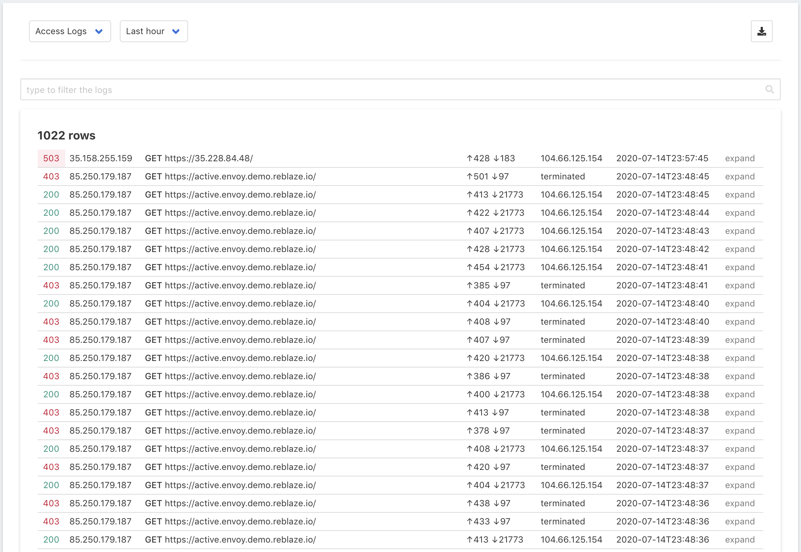
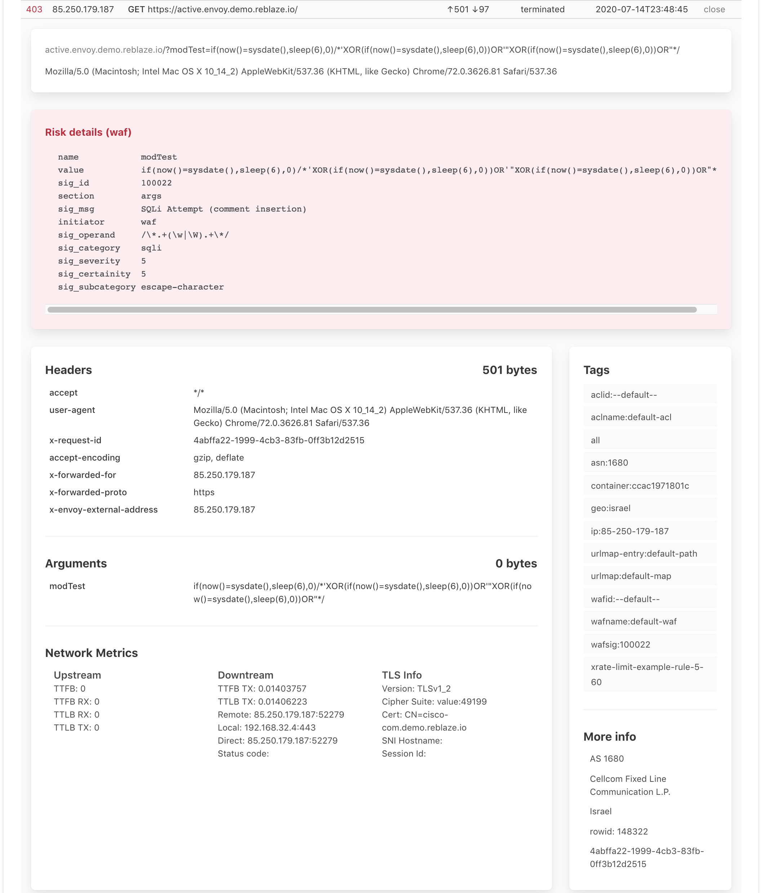

# Access Log

The Access Log displays requests that were received in the specified time period.

## Filtering the Display

By default, this page shows all requests in the time period. To filter the display, type a search string into the filter box. For example, to see all the 503 errors, use "503" as the filter string.

Multiple filters can be entered, delimited by commas. For example, "waf, 503" will display all the requests that were blocked by the WAF with a 503 error.

It's helpful to spend a few minutes experimenting with the filter box. You can quickly drill down through large swaths of traffic, discovering events and patterns that can reveal many insights about your traffic. This is helpful when constructing and fine-tuning security policies, especially during attacks.

## Viewing Request Details

The primary display shows a summary of each request. To view more information about a request, click on its listing, or on "expand" at the end of its listing. The display will expand to show its full details.

If a request was filtered, the "**Risk Details**" box highlights the reason\(s\) why it was viewed as a risk.

Below the Risk Details are other sections with the request's headers, arguments, and other information. The column on the right includes the [tags](../reference/tags.md) that were assigned to this request.

