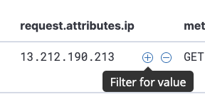

# Access Log \(ELK\)

The Access Log displays requests that were received in the specified time period.

## Filtering the Display

By default, this page shows all requests in the time period. To change the time period, use the controls at the top right of the window. You can also zoom into a subset of the time period currently being shown, by dragging the cursor across the columns in the graph. The controls above the graph define its granularity.

To filter the display, type a search string into the Search box. For example, to see only those requests that include the substring "script", enter it into the box.

To search for \(or exclude\) the value of an entire parameter, it is often faster to hover the cursor over an existing request with that value. For example, to show all requests originating from IP address `13.212.190.213`, you could manually enter that address into the Search box. Or, find an existing request with that value and hover the mouse over it. A "Filter for value" button will appear; selecting it will create the filter for you automatically.

More powerful filtering capabilities are available immediately below the Search box, by selecting **Add filter** and manually constructing one or more filtering criteria. 

The access log display will change as filters are constructed and edited. To remove all filters, select **Reset search** at the top of the graph.

It's helpful to spend a few minutes experimenting with these filtering capabilities. You can quickly drill down through large swaths of traffic, discovering events and patterns that can reveal many insights about your traffic. This is helpful when constructing and fine-tuning security policies, especially during attacks.

## Viewing Request Details

The primary display shows a summary of each request. To view more information about a request, click on the twirl control \(**&gt;**\) at the beginning of its listing. The display will expand to show its full details.

All the details of the request are shown. Hovering the cursor over a parameter, as shown for the `headers.request_method` example above, shows controls where you can easily construct a filter for it.

Within the expanded display, the `tag` field can be especially useful.

This shows all the [tags](../reference/tags.md) that were assigned to this request. It can be helpful in understanding how Curiefense evaluated this request, and the decisions that it made. 

