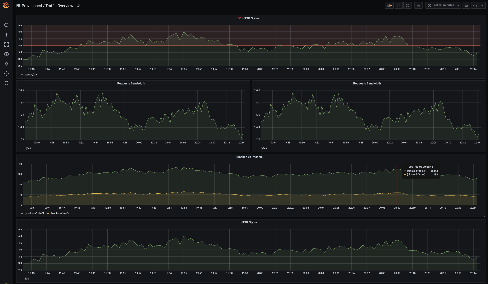
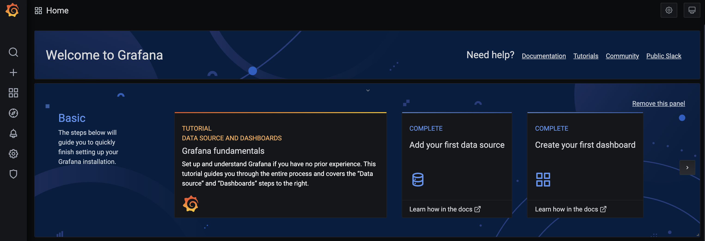
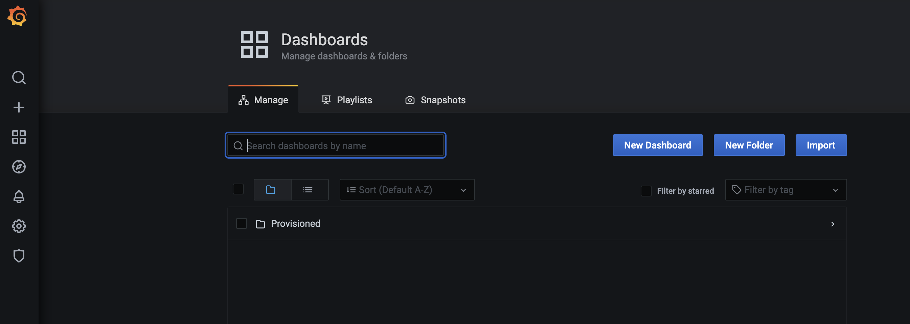
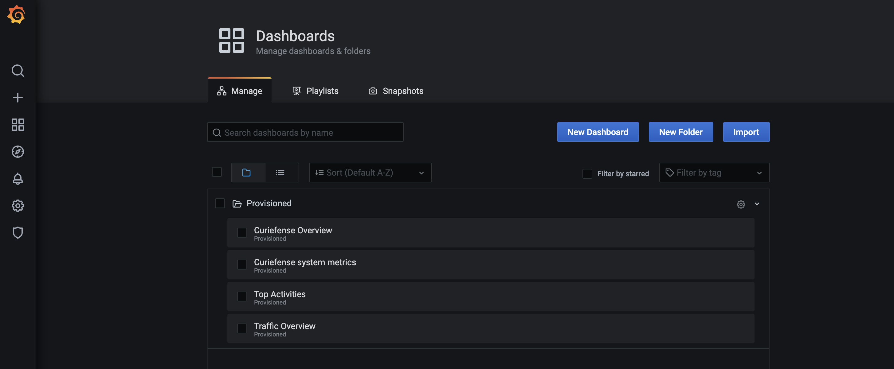

# Grafana

## Introduction

Out of the box, Curiefense stores metrics using [Prometheus](https://prometheus.io/), and provides dashboards and alerts via [Grafana](https://hub.docker.com/r/grafana/grafana/). 

* [Details of Curiefense's prometheus service](../reference/services-container-images.md#prometheus)
* [Details of Curiefense's grafana service](../reference/services-container-images.md#grafana)

By default, Curiefense includes several Grafana dashboards, or you can create your own. See also the Community-Supported dashboards, described in a later section below.

## Accessing the Dashboards

In a standard installation, the Grafana dashboards are accessible at [http://localhost:30300/](http://localhost:30300/). Selecting the **Grafana** link in the UI sidebar should send you there directly.

To login, the default username and password are `admin` and `admin`.

After logging into Grafana, you will see this:

On the Dashboards menu, select "Manage":

This will reveal the Provisioned folder:

Opening the Provisioned folder will reveal the default Curiefense dashboards:

Selecting a dashboard will open it. Then specify the date/time range to display.

## Default Dashboards

Curiefense includes several default dashboards, described below. It is also recommended that you evaluate the community dashboards, described in the next section.

#### Curiefense Overview

This dashboard shows:

* Total active connections
* Total requests
* Downstream total active connections
* Downstream total active requests
* Upstream network traffic
* Downstream network traffic
* Downstream members

#### **Curiefense System Metrics**

This dashboard currently shows a heatmap of Curielogger's SQL query duration.

#### Top Activities

This dashboard provides the ability to monitor the top metrics and sources of various security issues, including blocked requests, problematic traffic sources, URLs, and so on

* Top Countries
* URL maps
* URLs
* Methods
* Blocked Methods
* Blocking WAF IDs
* Blocking ACL IDs

#### Traffic Overview

* HTTP Status
* Incoming requests bandwidth
* Outgoing requests bandwidth
* Blocked vs Passed
* HTTP Origin Status

## Community-Supported Dashboards

The following dashboards are worth investigating, to evaluate them for your use case.

Grafana: There are a variety available at [https://grafana.com/grafana/dashboards](https://grafana.com/grafana/dashboards), especially [https://grafana.com/grafana/dashboards/14260](https://grafana.com/grafana/dashboards/14260).

Envoy users: [https://grafana.com/grafana/dashboards/6693](https://grafana.com/grafana/dashboards/6693)

NGINX users: [https://grafana.com/grafana/dashboards/5063](https://grafana.com/grafana/dashboards/5063)

Prometheus users: [https://grafana.com/grafana/dashboards/7901](https://grafana.com/grafana/dashboards/7901)

