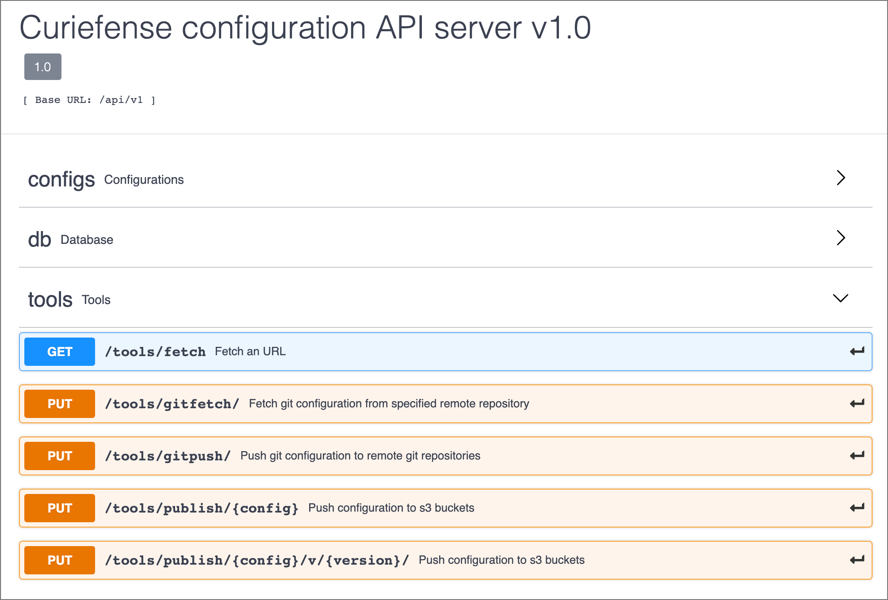

# API Namespaces and Endpoints

Curiefense includes an API with the following namespaces:

* **configs** \(for manipulating Configurations\)
* **tools** \(for publishing, etc.\)
* **db** \(for accessing persistent key value storage\)

These can be explored and seen visually by using [Swagger](https://swagger.io/) via the Curiefense SwaggerHub:

[https://app.swaggerhub.com/apis/curiefense/curiefense-configuration\_api\_server\_v\_1\_0/1.0\#/tools](https://app.swaggerhub.com/apis/curiefense/curiefense-configuration_api_server_v_1_0/1.0#/tools)

Each namespace contains various endpoints. For example, **tools** contains five:

Swagger is a useful way to experiment and interact with the API. For example, clicking on "/configs", selecting the "Try it out" button, and then selecting the "Execute" button will result in this:

Among other things, the cURL command line will be displayed, which can be copied and pasted for use elsewhere. It is also helpful sometimes to see the structure of the data.

For some endpoints, arguments need to be supplied. Swagger will provide input controls for them, as in this example:

