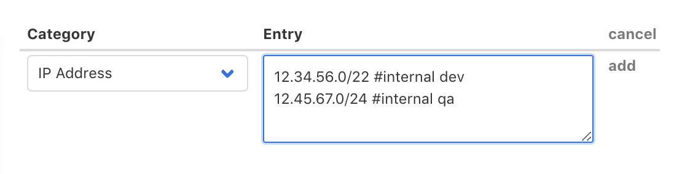
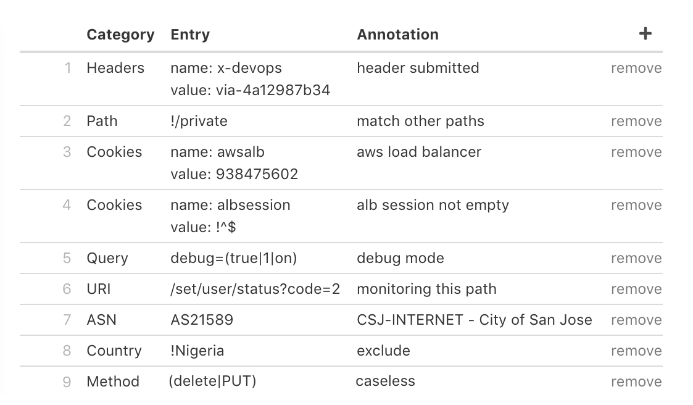

# Profiling Lists

The input controls at the top of this page are described here: [Document Editor interface](./#document-editor-interface). Specific editing of a Profiling List is described below.

## Overview

Early in the [traffic evaluation process](../../reference/multi-stage-traffic-filtering.md) \(immediately after the pre-processing Cloud Functions are performed\), Curiefense assigns **Tags** to an incoming request. Subsequently, the Tags can be used to make decisions about how the request is processed. After processing, a request's Tags remain associated with it, and they are available for display in the [Access Log](../../analytics/access-log.md).

This page allows you to administer **Profiling Lists**, which are combinations of [user-defined Tags](../../reference/tags.md#user-defined-tags) and the criteria for assigning them to requests.


The actions that can be performed as a result of the Tag assignments are administered separately in [Rate Limits](rate-limits.md).


Each Profiling List consists of:

* **Match conditions**: A list of possible characteristics that a request can match \(e.g., a list of IP addresses that it might originate from\), plus the logical operator to use when evaluating the match.
* **One or more Tags to assign** when a match occurs. 

For each incoming request, Curiefense will evaluate all active Profiling Lists. A single request will receive Tags from all Lists which match it.

### Two Types of Profiling Lists

Profiling Lists can be either Internet-sourced or self-managed.

* **Internet-sourced** Lists are based upon online sources \(e.g., Spamhaus DROP lists\). The entries for these lists are not editable within the interface, because they are obtained automatically; Curiefense updates them every 24 hours.
* **Self-managed** Lists are created manually. These are fully editable within the interface.

## Profiling List Metadata

| Field | Meaning |
| :--- | :--- |
| **Name** | A description that will be displayed within the Curiefense interface. |
| **Tags** | One or more Tags \(separated by spaces\) that will be assigned to requests if the match conditions are fulfilled. Example: `internal team-devops`. |
| **Source** | For an Internet-sourced list, the URL of the source. Otherwise, this is`self-managed`. |
| **Entries Relation** | See "Specifying Match Conditions", below. |
| **Active** | By default, the Profiling List will be applied to incoming requests. To prevent this, unselect the checkbox. |
| **Notes** | An optional field for including additional information. |

## Specifying Match Conditions

Match conditions consist of two parts:

* A list of one or more criteria to match. The list will be entered differently for the two types of Profiling Lists.
* The logical condition to apply \(either OR or AND\), specified in the **Entries Relation** pulldown 

### Match Criteria for an Internet-sourced Profile

For a Profile based on an online source, simply enter its URL into the **Source** field. For example, to create a list based on the Spamhaus ASN DROP list, you would enter [https://www.spamhaus.org/drop/asndrop.txt](https://www.spamhaus.org/drop/asndrop.txt). Curiefense will then populate the list automatically.

If the list contains more than category--which is unlikely for an Internet-sourced Profile, but not impossible--also choose the appropriate value for Entries Relation, as discussed below.

At this point, the new Profiling List should be complete. Before exiting the page, be sure to save your work.

### Match Criteria for a Self-Managed Profile

To add a match criterion, select the "**+**" button at the top of the criteria list. The following dialog will appear.

For most of the categories, the dialog will appear as it is above. Multiple entries can be made at once, with each entry on a separate line. Each line contains the value, plus a pound sign \(\#\) followed by an **annotation** \(a label for display within the Curiefense interface\). Example:

For some categories, one entry can be made at a time, with each entry requiring multiple lines. Annotations are not preceded by a pound sign.


Match criteria are case-insensitive.


Here are some sample entries for the various categories. Notice that the logical operators are available.

Once created, these entries cannot be edited. If one needs to be modified, remove it and re-create it.

### The Entries Relation Field

This specifies the logical operation used when evaluating a request against the match criteria.

When all the match criteria are in the same category, the operation is OR. For a request `x` and list of criteria `a, b, c` , then the evaluation will be `(x==a) OR (x==b) OR (x==c)` For example, if the match criteria are all IP addresses, then a match will occur if the request matches any of the IPs in the list.

When there are two or more categories, the default operation is still OR \(in which case, a match will occur if the request matches any of the criteria in the list\). However, when there are multiple categories, you can select AND instead. In this case, OR will still apply within each category, while AND will apply between the categories. Thus, for one list `a, b, c` and a second list `i, j, k` , the evaluation will be `((x==a) OR (x==b) OR (x==c)) AND ((x==i) OR (x==j) OR (x==k))`. For example, if the match criteria are IP addresses and headers, then a match will occur if the request matches any of the IPs and any of the headers, but it will not occur if it matches an IP but none of the headers.

