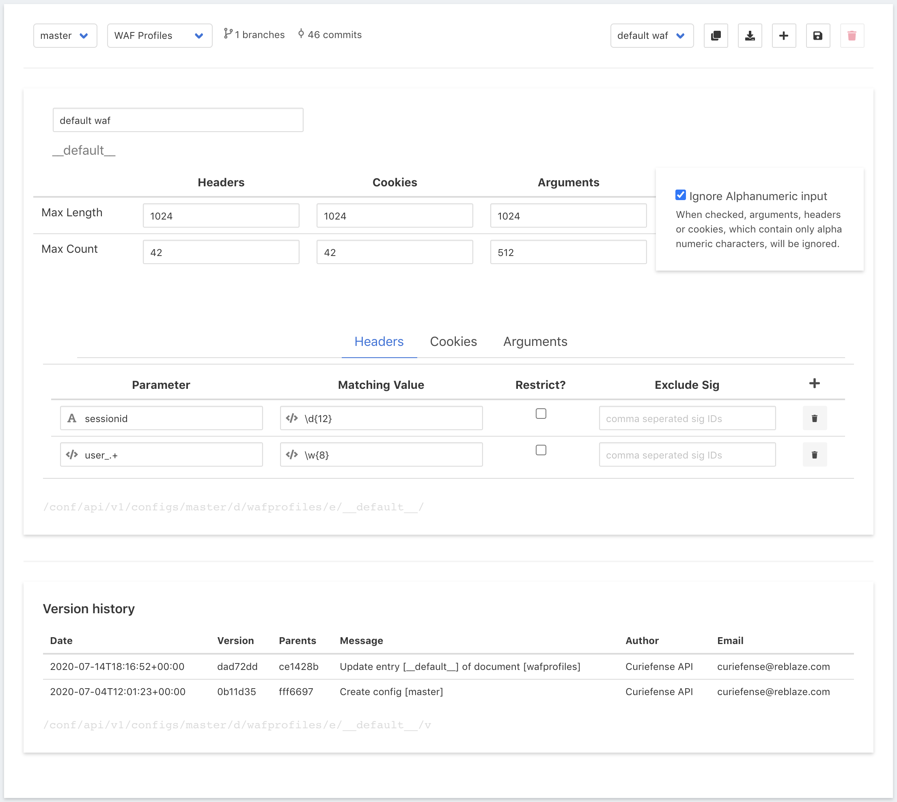
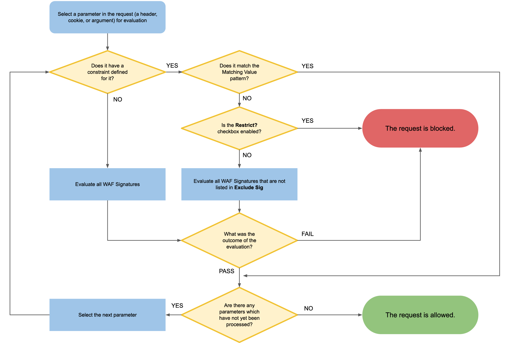

# WAF Profiles

The input controls at the top of this page are described here: [Document Editor interface](./#document-editor-interface). Specific editing of a WAF Profile is described below.

## Overview

A WAF Profile is a set of security policies that are used by the Curiefense WAF \(Web Application Firewall\). Every deployment includes a default WAF Profile, and additional Profiles can be created. 

Every URL that Curiefense protects has a WAF Profile assigned to it in [URL Maps](url-maps.md). \(If none is assigned explicitly, the default is used.\) A request sent to a URL might, or might not, be filtered according to the assigned Profile. 

#### Reasons why WAF filtering might not occur:

* The request was blocked before WAF filtering would have occurred. \(Before the WAF is used, [several other stages of filtering occur first](../../reference/multi-stage-traffic-filtering.md).\)
* The applicable [ACL Profile](acl-profiles.md) resulted in an Action of Bypass, which exempts the request from WAF filtering. 
* The WAF is not in [Active Mode](url-maps.md#editing-its-path-maps) for this URL.

## Input Characteristics

At the top of the page, the following values are defined for incoming requests.

| Constraint | Meaning |
| :--- | :--- |
| **Max Length** | The maximum allowable length of a header, cookie, or argument. |
| **Max Count** | The maximum number of headers, cookies, or arguments allowed.  |
| **Ignore Alphanumeric input** | When this is selected, the WAF will not inspect requests that only contain alphanumeric characters. This reduces computational overhead by not evaluating benign requests. \(Hostile requests such as SQLi, XSS, etc., will contain some non-alphanumeric characters.\)  |

## Content Filtering and Whitelisting

By default, an incoming request will be compared to all the [WAF Signatu](waf-signatures.md)[res](waf-signatures.md). If any parameter \(any header, cookie, or argument within it\) fails this evaluation, the request will be blocked.

However, parameters can be whitelisted and exempted from this filtering. For each parameter, this can be done in two ways:

* Full exemption is available by specifying a regex pattern which, if it matches the parameter's value, will exempt that parameter from WAF Signature evaluation.
* Partial exemption is available by specifying a list of WAF Signatures which will not be evaluated, even if the regex pattern is not matched. 

Along with this content whitelisting, a "positive security" form of content filtering is also available. Curiefense can be configured to require certain content in a specified parameter, and reject requests that do not contain it.

## Parameter Content Constraints

The bottom part of the UI defines Curiefense's behavior for both whitelisting and content filtering for each parameter. 

In the following discussion, a **constraint** refers to the values in the UI input controls \(_Parameter_, _Matching Value_, _Restrict?_, and _Exclude Sig_\) that have been specified for one parameter.

Each incoming request is processed like this:

This behavior is defined in the following fields in the UI. 

<table>
  <thead>
    <tr>
      <th style="text-align:left">Field</th>
      <th style="text-align:left">Value</th>
    </tr>
  </thead>
  <tbody>
    <tr>
      <td style="text-align:left"><b>Parameter</b>
      </td>
      <td style="text-align:left">The parameter whose value will be compared to the <b>Matching Value</b>.
        This can be provided as a specific <b>Name</b> (e.g., <em>sessionid</em>),
        or as a <b>Regex</b> to match multiple parameters (e.g., <em>user_.+</em>).
        Note that a Name will be marked with a capital &quot;A&quot;, while a Regex
        will be marked with &quot;&lt;/&gt;&quot;.</td>
    </tr>
    <tr>
      <td style="text-align:left"><b>Matching Value</b>
      </td>
      <td style="text-align:left">A regex pattern. If a parameter&apos;s value matches it, the parameter
        will be exempted from WAF Signature filtering. If it does not match, the <b>Restrict?</b> option
        becomes relevant.</td>
    </tr>
    <tr>
      <td style="text-align:left"><b>Restrict?</b>
      </td>
      <td style="text-align:left">If a parameter does not match the Matching Value, and <b>Restrict?</b> is
        selected, then the request is blocked. If <b>Restrict?</b> is not selected,
        then the <b>Exclude Sig</b> option becomes relevant.</td>
    </tr>
    <tr>
      <td style="text-align:left"><b>Exclude Sig</b>
      </td>
      <td style="text-align:left">
        
A parameter which fails its <b>Matching Value</b> comparison, and for which <b>Restrict?</b> is
          not selected, will be filtered by all WAF Signatures except the ones whose
          IDs are listed here. (For example, some WAF Signatures filter out special
          characters; if a certain parameter can legitimately contain these characters,
          it would make sense to exempt that parameter from those specific filters
          .)
           
           It is also possible to always exempt a parameter from specific WAF Signatures:

        <ul>
          <li>List the signature IDs here</li>
          <li>Ensure that <b>Restrict?</b> is not selected</li>
          <li>And specify a <b>Matching Value</b> regex pattern that the parameter would
            never match.</li>
        </ul>
      </td>
    </tr>
  </tbody>
</table>

Constraints are defined in the same way for **Headers**, **Cookies**, and **Arguments** within their respective tabs.

