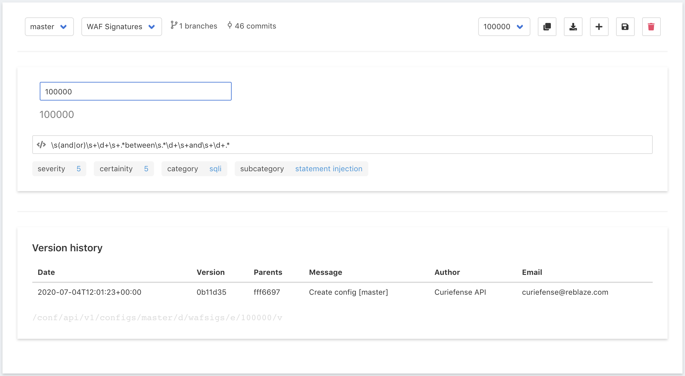

# WAF Signatures

This section displays all the WAF Signatures defined within Curiefense. This has various uses; for example, looking up the underlying signature for a tag that appears in the Access Log.

Note that this list is for reference only. The entries cannot be edited.

