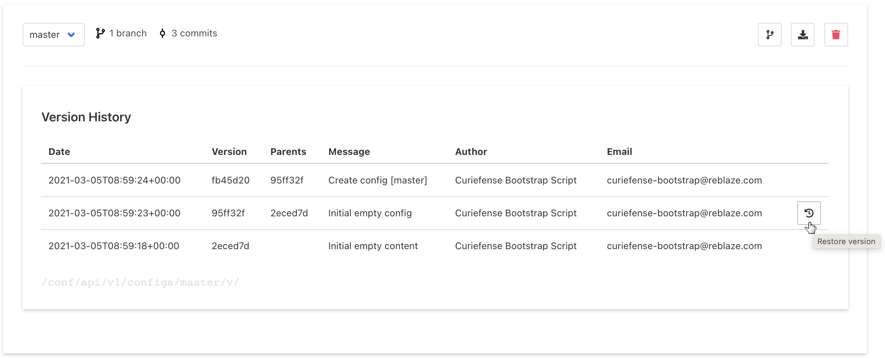

# Version Control

This page displays previous versions of configurations, and allows you to revert/restore the system to any saved configuration. 

To do this, hover the cursor over the desired configuration. The "Restore Version" button will appear, as shown above.

Select this button. Once the process is complete, [publish](../settings/publish-changes.md). Curiefense will push the selected configuration out to all deployments.
