# Getting Started with Curiefense

**Prerequisite**: Ubuntu 20.04 LTS

In this guide, we will deploy Curiefense using Docker Compose, then test and configure.

If you want to use Helm instead of Docker Compose, or if you want more control over the deployment options, then do this:

1. Go to the [Deployment in Depth: First Tasks](deployment-first-steps/first-tasks.md) page and follow its instructions. 
2. Go to the appropriate Deployment in Depth page \([Docker Compose](deployment-first-steps/docker-compose.md) or [Helm](deployment-first-steps/istio-via-helm.md)\) and follow its instructions.
3. Return here to the [Verify the Deployment](getting-started-with-curiefense.md#verify-the-deployment) section below, and continue.

## Let's begin

To ensure we have all tools in place, we will run:

```bash
sudo apt update
sudo apt install -y git docker.io docker-compose libpq-dev python3-dev gcc python3-psycopg2 vim
sudo usermod -aG docker $(whoami) && sudo -i -u $(whoami)
```

Grab the latest code from GitHub to get started:

```
git clone https://github.com/curiefense/curiefense.git
cd curiefense/deploy/compose/
docker-compose up
```

**💡 ProTip:** Try Curiefense out on [Katacoda](https://www.katacoda.com/curiefense), no install necessary.

## Verify the Deployment


This tutorial assumes that host names **curie.demo** and **api.curie.demo** are mapped to the host machine. You may replace it with the IP of your host, or set your`/etc/hosts` file accordingly. For example, if docker-compose was executed locally, then

`127.0.0.1 curie.demo api.curie.demo`


At this point you should have the following http interfaces:

| Interface | URL |
| :--- | :--- |
| Management UI | http://curie.demo:30080/ |
| Swagger API | http://curie.demo:30000/api/v1/ |
| Echo web server | http://curie.demo:30081/ |
| Grafana | http://curie.demo:30300/ |

Make sure everything is working by testing the echo server:

```text
curl curie.demo:30081

Request served by 1cebc4ed2938

HTTP/1.1 GET /

Host: curie.demo:30081
X-Envoy-Expected-Rq-Timeout-Ms: 15000
Accept: text/html,application/xhtml+xml,application/xml;q=0.9,image/webp,*/*;q=0.8
Accept-Encoding: gzip, deflate
X-Request-Id: 50d6bdea-58ed-4c9d-9d26-c8eeff432817
Cookie: csrftoken=u97m660E9Pji8PvSpAGWU3K4pVsl2N4mTscK00bvO8Jkb7h3nTTQQR8FuArzPgIk; CSRF-Token-X3TDN=bEYiHVfq9RvWY4UbyeLN4CWrfqyLevuj; redirect_to=%2F
Upgrade-Insecure-Requests: 1
X-Forwarded-For: 172.18.0.1
X-Forwarded-Proto: http
X-Envoy-Internal: true
User-Agent: Mozilla/5.0 (X11; Linux x86_64; rv:81.0) Gecko/20100101 Firefox/81.0
Accept-Language: fr,fr-FR;q=0.8,en-US;q=0.5,en;q=0.3
Content-Length: 0
```

## Deployed Containers Overview

This section describes the newly-described components of Curiefense. Feel free to skip it if desired, and go straight to the instructions for [policy and rules configuration](getting-started-with-curiefense.md#policy-and-rules-configuration).

### What Have We Just Deployed?

This diagram will help us understand the containers we just deployed, their connections, and the data flow:

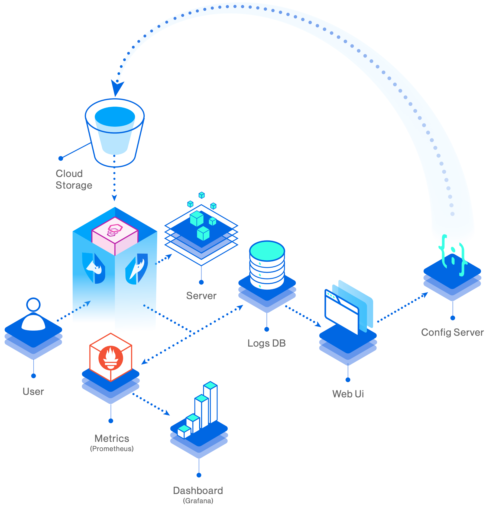

| Container Name | Purpose and Functionality |
| :--- | :--- |
| curieproxy | Envoy built with our modules |
| curiesync | ensures configurations are always in sync with latest policies and rules changes |
| confserver | API server to manage configuration |
| uiserver | UI Management Console |
| echo | Dummy web server for testing |
| logdb \* | stores access log |
| grafana \* | dashboards |
| prometheus \* | stores time series metrics |
| redis \* | Synchronizes session and rules across deployments and Envoy containers |
|  | \(\*\) You may replace these containers with your own if desired. |

### Terminology and Concepts

Before diving in and making changes, let's discuss a few concepts of Curiefense's configuration.

* Git is the storage management used to keep track of changes. This means:
  1. Data can be stored anywhere a git repository can \(local, remote, hosted, etc\).
  2. Every change you made can be reverted.
  3. You can automate deployments based on tagging.
  4. Using a single configuration server, you can maintain configurations of multiple deployments \(e.g. production, devops, qa, rc, etc.\) by keeping each in a separate branch, and you can merge them the git way at any point in time, via the API and/or UI.
* Configurations are organized in Documents and Entries. More on this [here](../#data-structures).


## Policy and Rules Configuration

Curiefense runs every incoming request \(and in some cases, responses as well\) through a series of mechanisms. We will now walk through some of them to understand how traffic is handled and processed.

During the procedures described below, you will set up some simple rules and then run some requests through Curiefense. By the end of this process, you will understand how to create security rules and policies, you will observe them being applied, and you will see how Curiefense reports on incoming requests and its reactions to them.

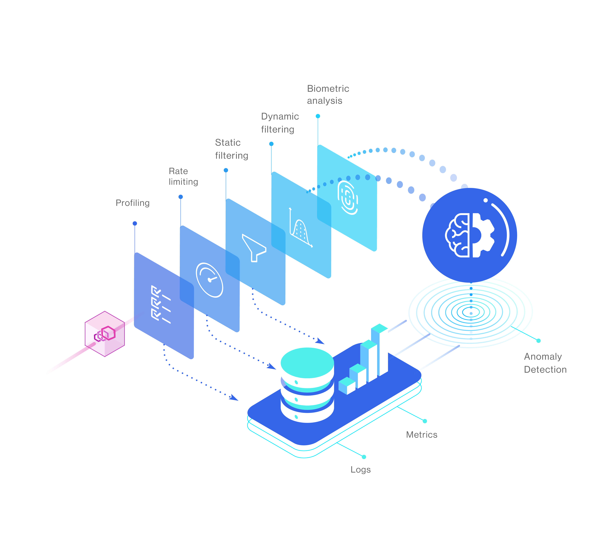

### Open the UI

Open the UI management console by going to [http://curie.demo:30080/](http://curie.demo:30080/). In the left sidebar, select **Policies & Rules** if it is not already selected.

At the top left of the page, in the second pulldown control, select **Tag Rules**.

### Create a Tag Rules list

Tag Rules lists attach tags to requests and sessions based on various criteria, from matching headers, cookies, arguments or URLs to traffic sources such as geolocations, IP addresses, CIDRs, and AS numbers. Subsequently, the tags are then used to make decisions about how the requests are handled.

Start by creating a new Tag Rules List by selecting the "**+**" button at the top:

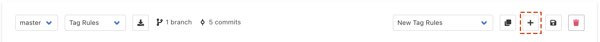

Next, in the **Tags** text box on the left, enter the value `trusted` .

Then, at the top of the \(currently empty\) list to the right, add a new entry by selecting the **Create New Section** button. An empty rule will appear.

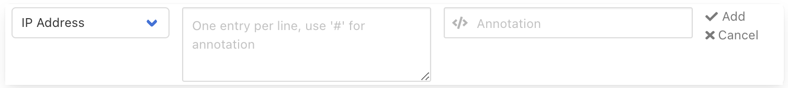

In the left pulldown, select **Header**. Enter `foo` for its name, and `bar` for its value. Then select "**Add**".

Your screen should look similar to this:

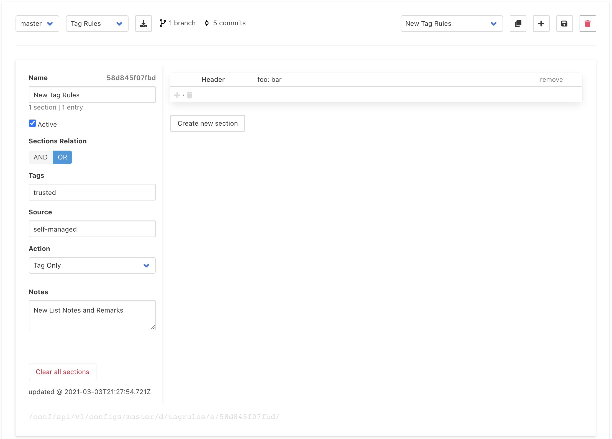

We have created a simple tag rule. Every request that contains a header named `foo` which matches the regex \(PCRE\) `bar` will receive a tag of `trusted`. 

Now save the new configuration:

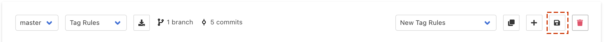

And then publish it by going to "Publish Changes" in the left sidebar, and selecting **Publish configuration**:

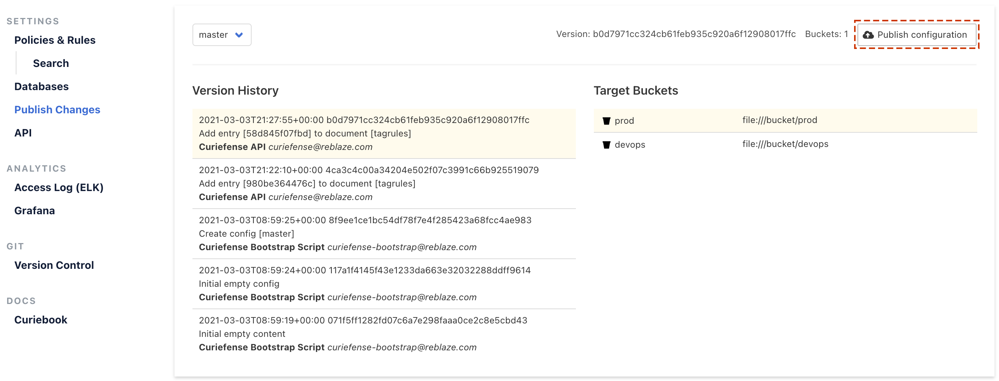


After publishing, your changes need time to propagate. Waiting 10-15 seconds should be enough.


Now it is time to test our configuration. Let's run the following curl commands:

```text
curl http://curie.demo:30081/no/header
curl http://curie.demo:30081/with/header -H "foo: bar"
```

Navigating to **Access Log** in the left sidebar should show a screen similar to this:

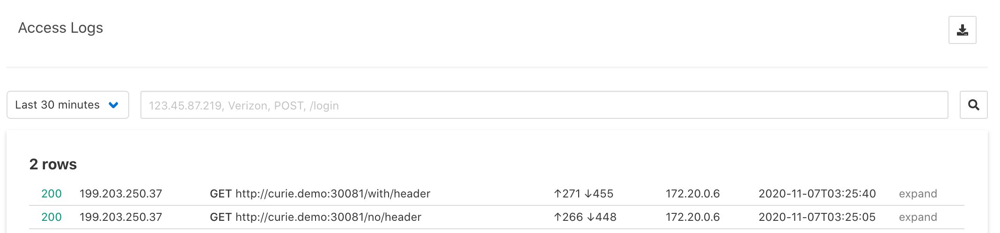

Click on the `/with/header` entry, and notice the `trusted` tag on the right column:

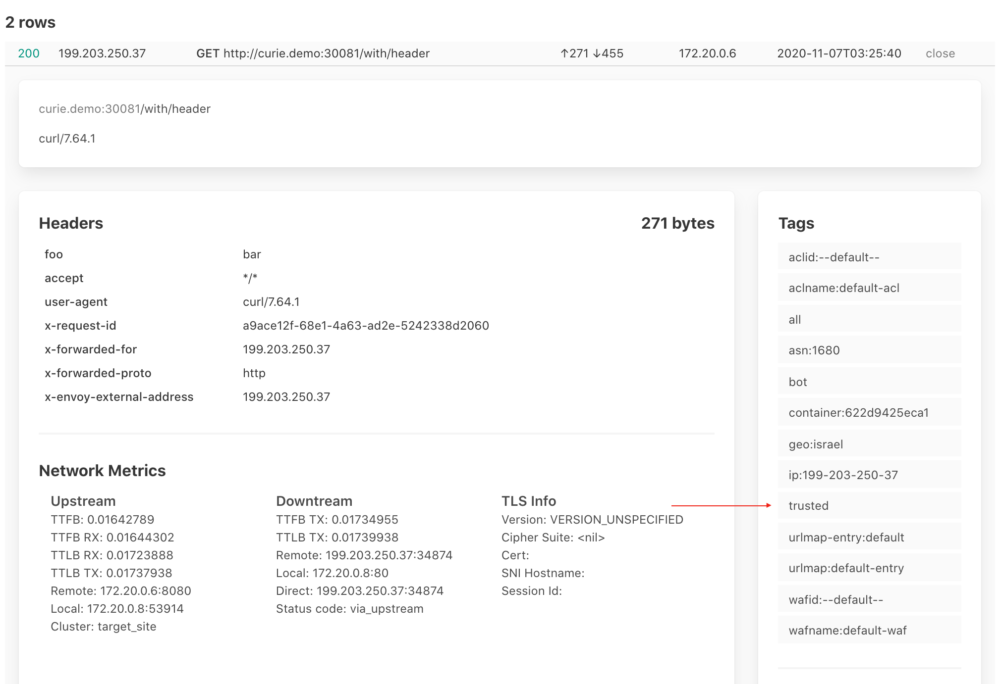

Notice also that along the `trusted` tag you defined, Curiefense attached a number of tags that were generated automatically. [More information about this](../reference/tags.md#automatic-tags).

Tag Rules Lists are a powerful feature of Curiefense \(and are explained in depth [here](../settings/policies-rules/tag-rules.md)\). We just demonstrated the ability to create a single-entry self-managed list that characterizes incoming requests based on a header. Curiefense allows you to attach tags based on complex combinations of headers, arguments, cookies, geolocation, methods, paths, and more. External data sources are also supported; sessions can be profiled based on data and rules defined by a third party, such as blocklists and whitelists.

Now that we know how to attach tags to incoming requests, let's tell Curiefense how to react to them.

### Create an ACL \(Access Control List\)

We're going to block all requests with the `trusted` tag. 

In the left menu, navigate to **Document Editor**. By default, **ACL Profiles** should already be selected.

Enter `trusted` into the **DENY** column, then save your changes.

Your screen should look similar to this:

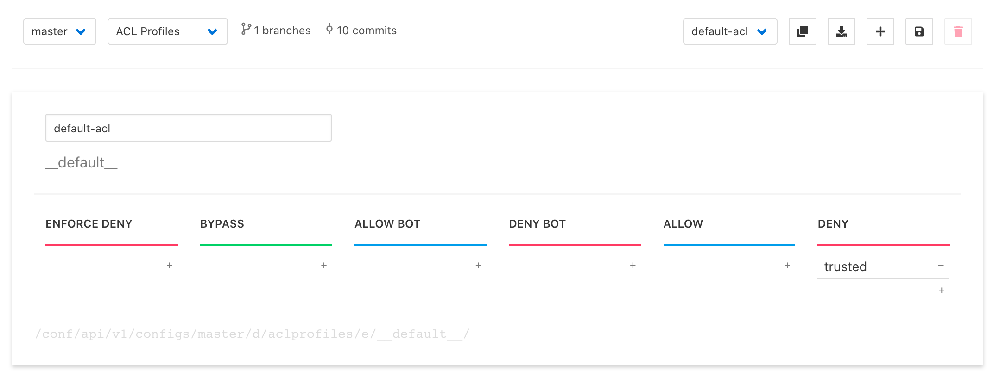

Publish the new configuration again \(and wait 15 seconds for the changes to propagate\).

#### Test the ACL

Run this command:

```text
curl http://curie.demo:30081/with/header -H "foo: bar"
```

In the Access Log, you should see the request listed. Expanding it will show this:


Note that the request was identified as a risk, because it contains the specified tag and therefore matches the **DENY** ACL.

However, Curiefense passed the request through the system, as seen in the green HTTP status code \(**200:** successful\). If it had been blocked, the code would instead be red with an error code.

This behavior is expected. By default, Curiefense's security profiles are in report/monitor mode; requests will be flagged but not blocked. This mode allows for testing and fine-tuning of new configurations without affecting traffic.

Let's assume that we've tested our new policies and want to make the ACL active.

#### Activate the ACL

Navigate to **Document Editor** and then choose to edit **URL Maps** in the upper dropdown list**.** 

URL Maps assign security policies to paths within the protected application. You can assign policies at any scale, from globally down to individual URLs. \(They are explained in depth [here](../settings/policies-rules/url-maps.md).\) 

We're going to edit Curiefense's default security profile: the one that applies to every URL which does not otherwise have any policies assigned to it.

Expand the **default** profile \(the one assigned to path `/`\) by selecting it. Then activate the profile by checking the **Active Mode** checkbox. 

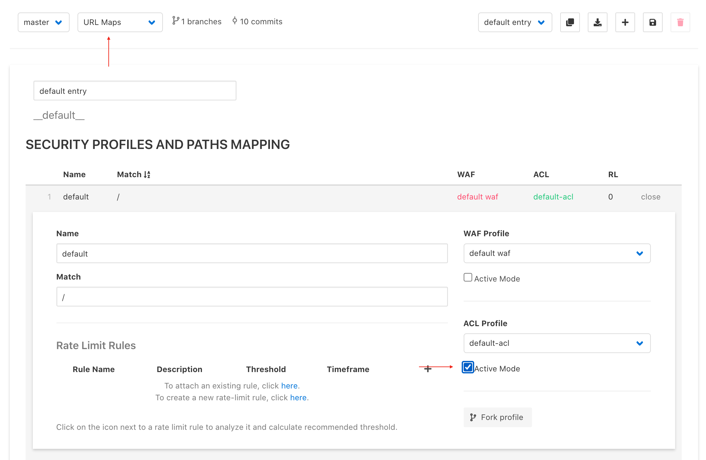

Save your changes and publish the configuration again. 

After the change propagates, Curiefense should block the request:

```text
curl http://curie.demo:30081/with/header -H "foo: bar"
curiefense - request denied
```

### Add Rate Limiting

You have seen how to create security policies that filter hostile requests, and how to assign these policies to paths within your application.

Now we'll see how to filter requests that are not obviously hostile at first, but which display hostile intent with increased volume. For example, a user who fails a login attempt might have mistyped their password—but a user who fails ten login attempts in a short time is probably trying to guess the password for an account they do not own.

#### Add a Rate Limit

Return to **URL Maps** and select the default profile again. At the bottom of its map, there is the Rate Limit Rules section. Currently, it is empty.

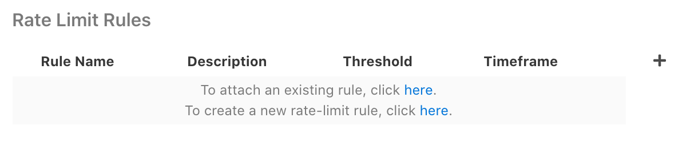

Attach an existing rule by select the first "here" link. A pulldown list of available Rate Limit Rules will be displayed.

Open the list, and select its only entry \(the one that comes by default with the system\). This rule limits requests from a given IP address to a maximum of 5 requests per 60 seconds.

Select the "add" link to add this rule to the default URL Map.

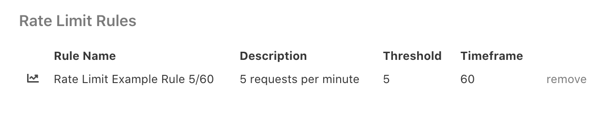

Save your changes, and then publish.

After propagation, we can test it:

```text
while true; 
do 
    curl -s -o /dev/null -w "%{http_code}" http://curie.demo:30081/with/header -H "foo: bar";
    printf ", "; 
    sleep 1s; 
done
```

Wait briefly, and you should see how the response changes from 403 \(ACL\) to 503 \(Rate limit\) on the 6th request.

```text
403, 403, 403, 403, 403, 503, 503, 503, 503, 503, 503, 503, 503...
```

### Add Multiple Rate Limits

Now that we're somewhat familiar with the system, let's set up multi-layered rate limiting to protect against a variety of attacks.


Rate limits in Curiefense are reusable "stand-alone" rules that can be attached to different paths in [URL Maps](../settings/policies-rules/url-maps.md).


Previously, we used the default Rate Limit that comes with Curiefense, and applied it to the entire domain. Now we will create three specific Rate Limits for the login process of an API, and attach them to the relevant endpoints. 

#### Creating a URL Map for the API

Create a new URL Map by duplicating the default one:


Set its **name** \(the unlabeled field at the top\) to `API`. Set **Matching Names** to `api.curie.demo`.


#### Adding Profiles

Note that the new URL Map contains a default profile. As you might expect, this will apply to every path within the scope set by the **Matching Names** entry. \(In this tutorial, the **Matching Names** is a specific subdomain. In production use, this might be a regex describing a range of domains, subdomains, or URLs.\)

To add a profile to a URL Map, open an existing profile \(in this case, the default\) and select the **Fork profile** button.

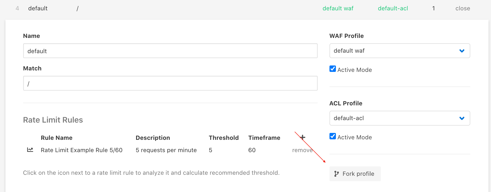

Edit the Name and Match condition of the profile and then repeat this process twice more, so that there are four profiles in total. The Names and Match Conditions are shown below:

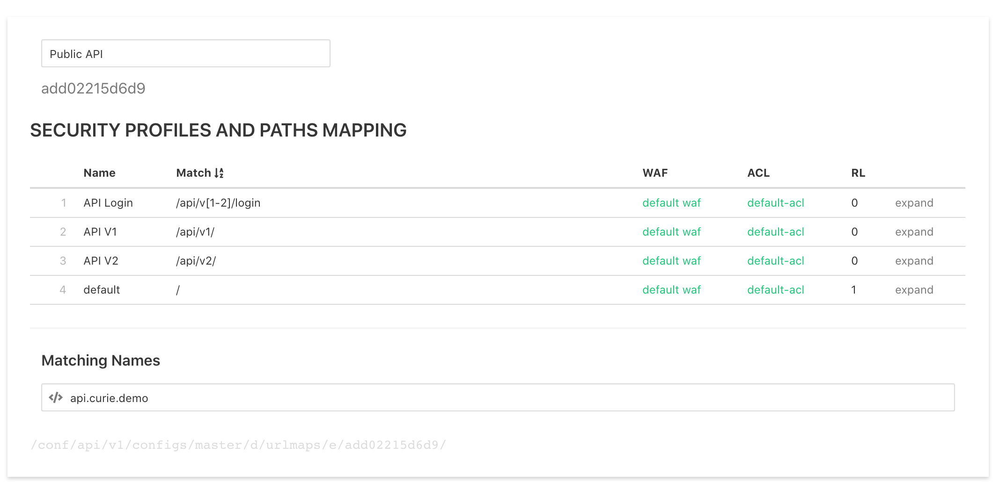

At this point, we have four profiles: the default `/` which we left in place, `/api/v1/` and `/api/v2` to match API calls of different versions, and an entry for `/login` that catches both versions.

#### Setting Rate Limits

Note that the default has one Rate Limit attached to it \(shown as a "1" in the **RL** column\), because it already had this when it was duplicated. The other three profiles do not yet have any limits.

For `/api/v1/` and `/api/v2/` , set the standard rate limit rule as you did before:

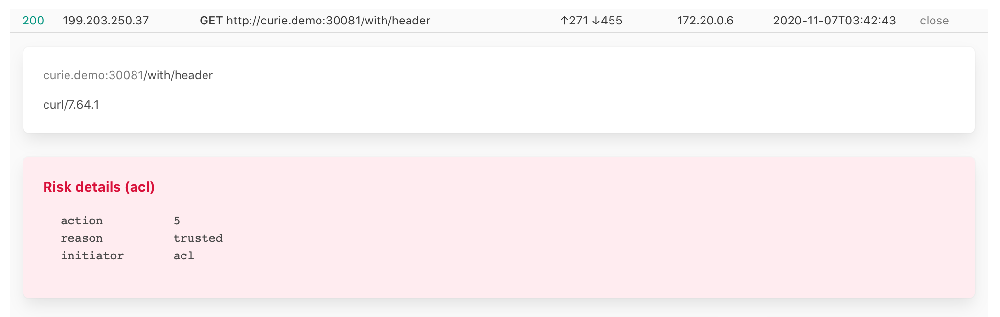

For `/api/v[1-2]/login`, we will create three new rate limit rules. 

#### Create New Rate Limits

Open the Rate Limits section of the UI by selecting **Rate Limits** at the top of the window \(in the pulldown list that currently says **URL Maps**\).

The default Rate Limit should be displayed. Add a new Rate Limit by duplicating it, using the Duplicate Document button in the top right part of the interface.

#### Rule \#1: Limiting IPs

Edit the new Rate Limit so that it limits login attempts from the same IP address, allowing a maximum of three within 10 minutes:

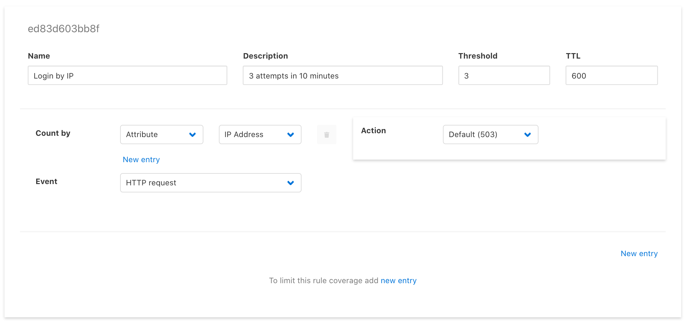

#### Rule \#2: Limiting locations

Create a second Rate Limit by duplicating an existing one. Edit it so that it limits a given User-Id header to a single country within a four hour timespan:

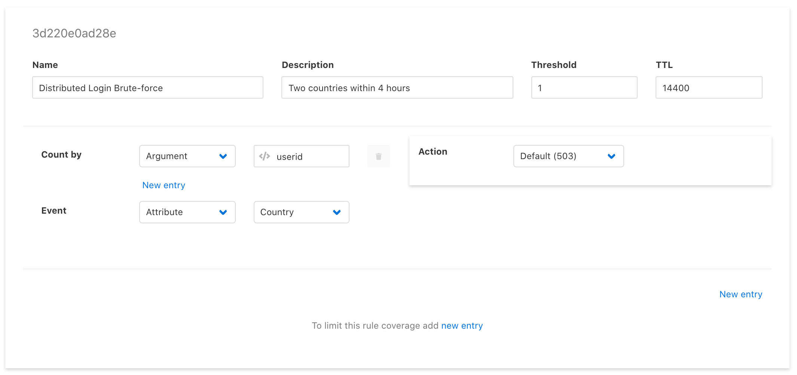

#### Rule \#3: Limit number of User IDs

Create a third Rate Limit by duplicating an existing one. Edit it so that it limits each IP to submitting a maximum of eight unique User IDs:

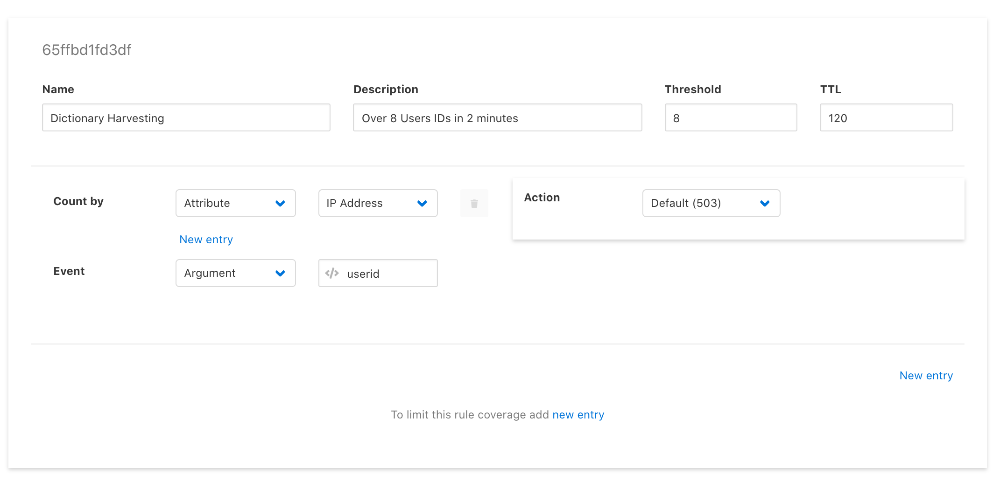

#### Using the new Rate Limit rules

Return to the URL Maps section of the interface. Let's attach the new rules to the `/api/v[1-2]/login` matching path.

Expand the appropriate profile, select the link at the bottom \("To attach an existing rule..."\), and select the first of the three new rules you created. Repeat for the second and third rules. When you're finished, you should see something similar to this:


#### Testing the new Rate Limits

Next, let's try to brute-force the login endpoint, using the same user id and IP, but with a new password each time:

```text
while true; 
do 
  curl -s -o /dev/null -w "%{http_code}" \
     http://api.curie.demo:30081/api/v1/login \
     --data "userid=me@gmail.com&password=$RANDOM" ; 
  printf ", "; 
  sleep 1s; 
done
200, 200, 200, ... 503, 503, 503, 503, ...
```

To test the other rule, we will have curl send a unique User ID each time:

```text
while true; 
do 
  curl -s -o /dev/null -w "%{http_code}" \
     http://api.curie.demo:30081/api/v1/login \
     --data "userid=$RANDOM@gmail.com&password=$RANDOM" ; 
  printf ", "; 
  sleep 1s; 
done
```

As traffic gets blocked \(returning a 503 error by default\) we can look at the **Access Log**. When expanding a 503 line, you can see the Risk Details, which include the rate limit rule that was violated \(in this case, Dictionary Harvesting\). 

You can also see the system has generated a tag named after the rule name. Lastly, notice that every request is logged with all details.


### Advanced Rate Limiting

The demonstration above is only the beginning of what can be done with Rate Limiting. You can configure Curiefense to limit complex combinations of conditions and events, customize its reactions \(including blocking, redirecting, monitoring, responding with custom codes, adding headers to requests for backend evaluation\), and more.

Here's a common example. Rate Limits like the ones demonstrated above will block a requestor who exceeds a defined limit within the given timespan. However, once the limit resets, the requestor would be able to try again, and could repeat this cycle as often as desired. To prevent this, you can configure Curiefense to ban a requestor \(and block all of their requests\) when multiple rate limits are violated.

A full explanation of Curiefense's Rate Limits and their capabilities is available [here](../settings/policies-rules/rate-limits.md).  

## Grafana Dashboards

The docker-compose deployment process will create Grafana visualizations for Curiefense's traffic data.

Curiefense comes with two dashboards out of the box: Traffic Overview and Top Activities. They are available at [http://curie.demo:30300/](http://curie.demo:30300/).

#### Traffic Overview Dashboard


#### Top Activities


## Onwards

You now have a working Curiefense installation to experiment with. Its capabilities go far beyond those demonstrated in this tutorial; browsing through the rest of this Manual \(especially the [Document Editor](../settings/policies-rules/) section\) will give you some ideas to test, so you can see what the platform can do.

Note that this tutorial was a Quick Start guide, and therefore, it used many default options for the deployment. You might want to change some of them; for example, you might want Curiefense to use TLS for its UI server and for communicating with the backend.

Modifying the deployment is straightforward. For Docker Compose, just go through the procedures described [here](deployment-first-steps/docker-compose.md) and then re-run `docker-compose up`. For Helm, go through the procedures [here](deployment-first-steps/istio-via-helm.md).


