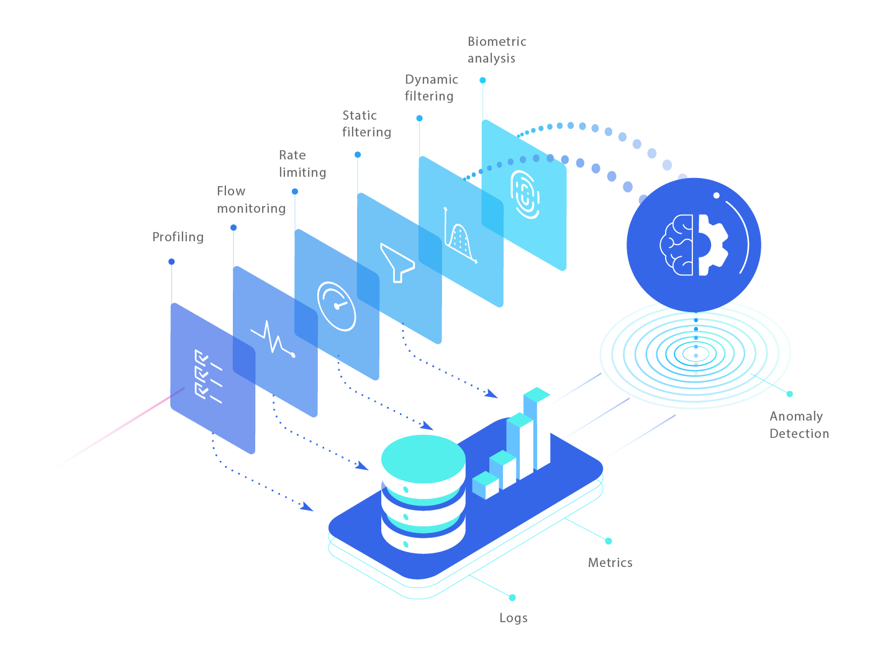
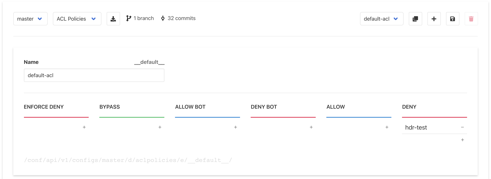
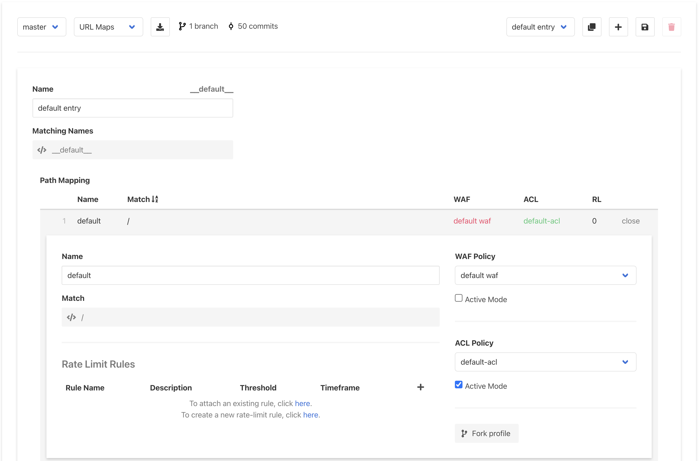
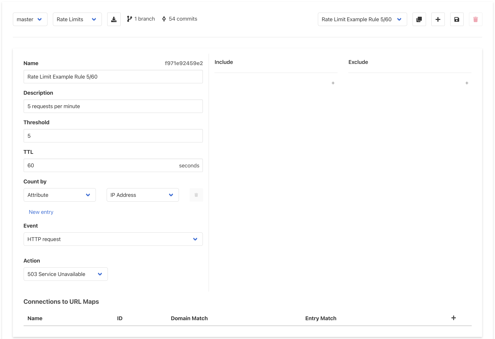
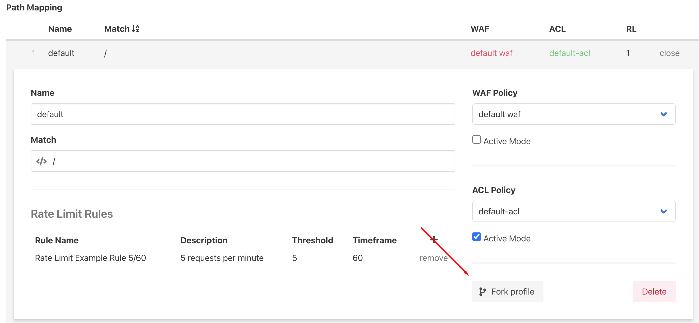
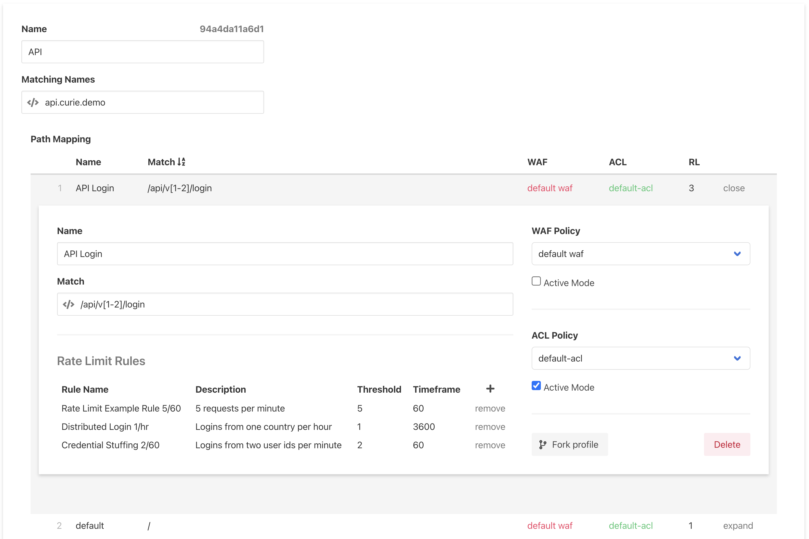

# Getting Started with Curiefense

**Prerequisite**: Ubuntu 21.04

In this Quick Start guide, we will deploy Curiefense using Docker Compose, then test and configure. 

Or, you can: 

* Go through the process at [Docker Compose deployment in depth](deployment-first-steps/docker-compose.md) for more control over the deployment options.
* Use Helm instead, by following the instructions here: [Istio via Helm](deployment-first-steps/istio-via-helm.md). 
* Deploy for NGINX instead, by following the instructions here: [NGINX deployment](deployment-first-steps/nginx.md).

If you choose any of these options, after you follow the instructions on the appropriate page, return here to the [Verify the Deployment](getting-started-with-curiefense.md#verify-the-deployment) section below, and continue.

## Let's begin

To ensure we have all tools in place, we will run:

```bash
sudo apt update
sudo apt install -y git docker.io docker-compose libpq-dev python3-dev gcc python3-psycopg2 vim
sudo usermod -aG docker $(whoami) && sudo -i -u $(whoami)
```

Grab the latest code from GitHub to get started:

```
git clone https://github.com/curiefense/curiefense.git
cd curiefense/deploy/compose/
docker-compose up
```

**💡 ProTip:** Try Curiefense out on [Katacoda](https://www.katacoda.com/curiefense), no install necessary.

## Verify the Deployment


This tutorial assumes that host names **curie.demo** and **api.curie.demo** are mapped to the host machine. You may replace it with the IP of your host, or set your`/etc/hosts`file accordingly. For example, if docker-compose was executed locally, then

`127.0.0.1 curie.demo api.curie.demo`


At this point you should have the following http interfaces:

| Interface | URL |
| :--- | :--- |
| Management UI | http://curie.demo:30080/ |
| Swagger API | http://curie.demo:30000/api/v1/ |
| Echo web server | http://curie.demo:30081/ |
| Grafana | http://curie.demo:30300/ |

Make sure everything is working by testing the echo server:

```text
curl curie.demo:30081

Request served by echo

HTTP/1.1 GET /

Host: curie.demo:30081
X-Forwarded-For: <redacted>
X-Forwarded-Proto: http
X-Envoy-Internal: true
X-Request-Id: 0bced763-5d06-4724-875d-c5936b948d80
X-Envoy-Expected-Rq-Timeout-Ms: 15000
User-Agent: curl/7.74.0
Accept: */*
```

## Deployed Containers Overview

This section describes the newly-described components of Curiefense. Feel free to skip it if desired, and go straight to the instructions for [policy and rules configuration](getting-started-with-curiefense.md#policy-and-rules-configuration).

### What Have We Just Deployed?

This diagram will help us understand the containers we just deployed, their connections, and the data flow:


| Container Name | Purpose and Functionality |
| :--- | :--- |
| curieproxy | \(Represented by the column with the Curiefense logo\) Performs traffic filtering |
| curiesync | Ensures configurations are always in sync with latest policies and rules changes |
| curietasker | Runs periodic maintenance tasks |
| curielogger | Pushes Envoy access log to postgresql and metrics to prometheus |
| confserver | API server to manage configuration |
| uiserver | UI Management Console |
| echo | Dummy web server for testing |
| elasticsearch \* | Stores access logs |
| kibana | Displays logs |
| filebeat | Sends logs to elasticsearch |
| grafana \* | Dashboards |
| prometheus \* | Stores time series metrics |
| redis \* | Synchronizes session and rules across deployments and Envoy containers |
|  | \(\*\) You may replace these containers with your own if desired. |

### Terminology and Concepts

Before diving in and making changes, let's discuss a few concepts of Curiefense's configuration.

* Git is the storage management used to keep track of changes. This means:
  1. Data can be stored anywhere a git repository can \(local, remote, hosted, etc\).
  2. Every change you made can be reverted.
  3. You can automate deployments based on tagging.
  4. Using a single configuration server, you can maintain configurations of multiple deployments \(e.g. production, devops, qa, rc, etc.\) by keeping each in a separate branch, and you can merge them the git way at any point in time, via the API and/or UI.
* Configurations are organized in Documents and Entries. More on this [here](../#data-structures).


## Policy and Rules Configuration

Curiefense runs every incoming request \(and in some cases, responses as well\) through a series of mechanisms. We will now walk through some of them to understand how traffic is handled and processed.

During the procedures described below, you will set up some simple rules and then run some requests through Curiefense. By the end of this process, you will understand how to create security rules and policies, you will observe them being applied, and you will see how Curiefense reports on incoming requests and its reactions to them.



### Open the UI

Open the UI management console by going to [http://curie.demo:30080/](http://curie.demo:30080/). In the left sidebar, select **Policies & Rules** if it is not already selected.

At the top left of the page, in the second pulldown control, select **Tag Rules**.

### Create a Tag Rule

Tag Rules attach tags to requests and sessions based on various criteria, from matching headers, cookies, arguments or URLs, to traffic sources such as geolocations, IP addresses, CIDRs, and ASNs. Subsequently, the tags are then used to make decisions about how the requests are handled.

Start by creating a new Tag Rule by selecting the "**+**" button at the top:


Next, in the **Tags** text box on the left, enter the value `hdr-test` .

Then, at the top of the \(currently empty\) list to the right, add a new entry by selecting the **Create New Section** button. An empty rule will appear.


In the left pulldown, select **Header**. Enter `foo` for its name, and `test` for its value. Then select "**Add**".

Your screen should look similar to this:


We have created a simple tag rule. Every request that contains a header named `foo` which matches the regex \(PCRE\) `test` will receive a tag of `hdr-test`. 

Now save the new configuration:


And then publish it by going to "Publish Changes" in the left sidebar, and selecting **Publish configuration**:



After publishing, your changes need time to propagate. Waiting 10-15 seconds should be enough.


Now it is time to test our configuration. Let's run the following curl commands:

```text
curl http://curie.demo:30081/no/header
curl http://curie.demo:30081/with/header -H "foo: test"
```

Navigating to **Kibana** in the left sidebar should show a screen similar to this:


This shows the two requests you just sent, in order of receipt \(with the newest on top\).

Click on the "&gt;" to expand the top entry:


All the information about this request is available here. Scroll down until you see the "tags" field:


You should see that Curiefense added the `hdr-test` tag.

Notice also that along the `hdr-test` tag that you defined, Curiefense attached a number of tags that were generated automatically. [More information about these](../reference/tags.md#automatic-tags).

Tag Rules Lists are a powerful feature of Curiefense \(and are explained in depth [here](../settings/policies-rules/tag-rules.md)\). We just demonstrated the ability to create a single-entry self-managed list that characterizes incoming requests based on a header. Curiefense allows you to attach tags based on complex combinations of headers, arguments, cookies, geolocation, methods, paths, and more. External data sources are also supported; sessions can be profiled based on data and rules defined by a third party, such as blocklists and whitelists.

Now that we know how to attach tags to incoming requests, let's tell Curiefense how to react to them.

### Create an ACL \(Access Control List\)

We're going to block all requests with the `hdr-test` tag. 

In the left menu, navigate to **Policies & Rules**. By default, **ACL Profiles** should already be selected.

Enter `hdr-test` into the **DENY** column. Your screen should look similar to this:



Save your changes, then publish the new configuration again \(and wait 15 seconds for the changes to propagate\).

#### Test the ACL

Run this command \(note the addition of the `-i` option\):

```text
curl -i http://curie.demo:30081/with/header -H "foo: test"
```

You should see output that looks something like this:

```yaml
HTTP/1.1 200 OK
content-type: text/plain
date: Tue, 03 Aug 2021 01:34:34 GMT
content-length: 308
x-envoy-upstream-service-time: 0
server: envoy

Request served by echo

HTTP/1.1 GET /with/header

Host: curie.demo:30081
X-Request-Id: dde00ccb-776a-4953-9011-51f7c52ed342
User-Agent: curl/7.64.1
Accept: */*
Foo: test
X-Forwarded-Proto: http
X-Envoy-Expected-Rq-Timeout-Ms: 15000
```

The `-i` allows us to see the response headers. Note that we received HTTP status code 200: "request succeeded." In other words, Curiefense did not block the request.

This behavior is expected. By default, Curiefense's security profiles are in report/monitor mode; requests will be flagged but not blocked. This mode allows for testing and fine-tuning of new configurations without affecting traffic.

This information is also visible in the access log. The log shows that Curiefense is configured to block the request, and the reason why this would happen:


And it also shows that the request was not actually blocked, because status code 200 was returned: 


Now let's assume that we've tested our new policies and we want to make the ACL active.

#### Activate the ACL

Navigate to **Policies & Rules** and then choose to edit **URL Maps** in the upper dropdown list**.** 

URL Maps assign security policies to paths within the protected application. You can assign policies at any scale, from globally down to individual URLs. \(They are explained in depth [here](../settings/policies-rules/url-maps.md).\) 

We're going to edit Curiefense's default security profile: the one that applies to every URL which does not otherwise have any policies assigned to it.

Expand the **default** profile \(the one assigned to path `/`\) by selecting it. Then activate the ACL Policy by checking its **Active Mode** checkbox. Note that the name of the ACL Policy changes from red to green.



Save your changes and publish the configuration again. 

After the change propagates, send the request again:

```text
curl -i http://curie.demo:30081/with/header -H "foo: bar"
```

 This time, Curiefense should block the request:

```yaml
HTTP/1.1 403 Forbidden
x-curiefense: response
content-length: 13
date: Tue, 03 Aug 2021 01:44:57 GMT
server: envoy

access denied  
```

As before, the blocking reason appears in the traffic log:


And so does the response status code:


### Add Rate Limiting

You have seen how to create security policies that filter hostile requests, and how to assign these policies to paths within your application.

Now we'll see how to filter requests that are not obviously hostile at first, but which display hostile intent with increased volume. For example, a user who fails a login attempt might have mistyped their password—but a user who fails ten login attempts in a short time is probably trying to guess the password for an account they do not own.

#### Add a Rate Limit

Return to **URL Maps** and select the default profile again. At the bottom of its map, there is the Rate Limit Rules section. Currently, it is empty.


Attach an existing rule by select the first "here" link. A pulldown list of available Rate Limit Rules will be displayed.

Open the list, and you should see a default entry that comes with the system. This rule limits requests from a given IP address to a maximum of 5 requests per 60 seconds.


If you don't see any default entries, click on the second "here" link to create a new Rate Limit. In the window that appears, create the rule shown below, save it, and then return to the URL Map.




Select the "add" link to add this rule to the default URL Map. The rule will then be displayed without the pulldown list:


Save your changes, and then publish.

After propagation, we can test it:

```text
while true; 
do 
    curl -s -o /dev/null -w "%{http_code}" http://curie.demo:30081/with/header -H "foo: test";
    printf ", "; 
    sleep 1s; 
done
```

Wait briefly, and you should see that on the 6th request, the response changes from 403 \(which means the ACL Policy is blocking the request\) to 503 \(which means the Rate Limit is blocking it\). 

```coffeescript
403, 403, 403, 403, 403, 503, 503, 503, 503, 503, 503, 503, 503...
```

In Curiefense, Rate Limit Rules are enforced before the ACL Policies \(as explained further here: [Multi-Stage Traffic Filtering](../reference/multi-stage-traffic-filtering.md)\). Thus, when a request would violate both, it is the Rate Limit Rule that blocks it.

### Add Multiple Rate Limits

Now that we're somewhat familiar with the system, let's set up multi-layered rate limiting to protect against a variety of attacks.


Rate limits in Curiefense are reusable 'stand-alone' rules that can be attached to different paths in [URL Maps](../settings/policies-rules/url-maps.md).


Previously, we used the default Rate Limit that comes with Curiefense, and applied it to the entire domain. Now we will create some specific Rate Limits for the login process of an API, and attach them to the relevant endpoints. 

#### Creating a URL Map for the API

Create a new URL Map by duplicating the default one:


Set its **name** \(the unlabeled field at the top\) to `API`. Set **Matching Names** to `api.curie.demo`.


#### Adding Profiles

As did the original URL Map, this new one contains a default profile. As you might expect, this will apply to every path within the scope set by the **Matching Names** entry. \(In this tutorial, the **Matching Names** is a specific subdomain. In production use, this might be a regex describing a range of domains, subdomains, or URLs.\)

Our hypothetical API has two versions: `/api/v1/` and `/api/v2/`. Let's say that the default profile is good enough for each of them. \(If it weren't, we could set up separate profiles for one or both instead.\) 

However, there are two endpoints where we want to set up stricter Rate Limiting: `/api/v1/login` and `/api/v2/login`. To do this, let's create a dedicated profile for the login endpoints. \(We could set up a separate profile for each endpoint, but in this case, we can accomplish this task with only one.\)

To add a profile to a URL Map, open an existing profile \(in this case, the default\) and select the **Fork profile** button.



Edit the Name and Match condition of the profile as follows: 


Now save your changes \(but you don't need to publish them yet\).

At this point, we have two profiles: the default `/` which we left in place, and an entry for `/login` that controls login access to both versions of the API.

#### Setting Rate Limits

Both profiles currently have the default Rate Limit assigned to them. 

For `/api/v[1-2]/login`, we will create two new rate limit rules. 

#### Create New Rate Limits

Open the Rate Limits section of the UI by selecting **Rate Limits** at the top of the window \(in the pulldown list that currently says **URL Maps**\).

The default Rate Limit rule should be displayed. Add a new Rate Limit by duplicating it, using the Duplicate Document button in the top right part of the interface.

#### Rule \#1: Limiting geolocation of a user's login attempts

An attacker who is trying to brute-force a login will get caught by the default Rate Limit rule. To evade this, attackers will often rotate their geolocations. So, if the same "user" attempts to login from different countries within a short time, it's probably an attack. Let's set up a rate limit to prevent this.

Edit the new Rate Limit so that it limits a given `userid` argument to a single country within a one-hour timespan. When you are done, save it.


In production use, you can use a similar tactic and limit the number of ASNs \(shown in the Curiefense interface as "Companies"\) per User ID. However, you'd want the rule to be less strict than the one shown here, to accommodate users who can legitimately change ASNs \(for example, a user who switches from coffee shop WiFi to a cellular data connection\).

#### Rule \#2: Limit number of User IDs

Another common threat is credential stuffing, where an attacker submits valid credential sets \(usually stolen from other sites\) in an attempt to see which ones will work, and then take over those accounts. Let's set up a Rate Limit for this.

Create a second Rate Limit by duplicating an existing one. Edit it so that it limits each IP to submitting a maximum of two unique User IDs per minute. When you are done, save it.


#### Using the new Rate Limit rules

Return to the URL Maps section of the interface; the API map that you created earlier should be opened for editing \(since it's the first one in the alphabetical list\). Let's attach the new rules to the `/api/v[1-2]/login` matching path.

Expand the API Login profile, select "**+**" to add a rule, select one of the two new rules you created, then select "**add**". Repeat for the second rule. When you're finished, you should see something similar to this:



Save your changes, publish them, and wait 15-20 seconds for propagation.

#### Testing the new Rate Limits

Next, let's try to brute-force the login endpoint, using the same user id and IP, but with a new password each time:

```text
while true; 
do 
  curl -s -o /dev/null -w "%{http_code}" \
     http://api.curie.demo:30081/api/v1/login \
     --data "userid=me@gmail.com&password=$RANDOM" ; 
  printf ", "; 
  sleep 1s; 
done
```

The first five attempts will succeed, and then the default Rate Limit will be triggered.

```coffeescript
200, 200, 200, 200, 200, 503, 503, 503, 503, ...
```

After waiting one minute to let the Rate Limit reset, we'll test the Credential Stuffing limit by having curl send a unique User ID each time:

```text
while true; 
do 
  curl -s -o /dev/null -w "%{http_code}" \
     http://api.curie.demo:30081/api/v1/login \
     --data "userid=$RANDOM@gmail.com&password=$RANDOM" ; 
  printf ", "; 
  sleep 1s; 
done
```

This time, only two login attempts are allowed:

```coffeescript
200, 200, 503, 503, 503, 503, ...
```

As before, the details of these events are available in the traffic log.

### Advanced Rate Limiting

The demonstration above is only the beginning of what can be done with Rate Limiting. You can configure Curiefense to limit complex combinations of conditions and events, customize its reactions \(including blocking, redirecting, monitoring, responding with custom codes, adding headers to requests for backend evaluation\), and more.

Here's a common example. Rate Limits like the ones demonstrated above will block a requestor who exceeds a defined limit within the given timespan. However, once the time period resets, the requestor would be able to try again, and could repeat this cycle as often as desired. To prevent this, you can configure Curiefense to ban a requestor \(and block all of their requests\) when multiple rate limits are violated.

A full explanation of Curiefense's Rate Limits and their capabilities is available [here](../settings/policies-rules/rate-limits.md).  

## Grafana Dashboards

The docker-compose deployment process will create Grafana visualizations for Curiefense's traffic data.

Curiefense comes with two dashboards out of the box: Traffic Overview and Top Activities. They are available at [http://curie.demo:30300/](http://curie.demo:30300/). 

To login, the default username and password are `admin` and `admin`. Then you should see this:


On the Dashboards menu, select "Manage":


This will reveal the Provisioned folder:


Opening the Provisioned folder will reveal the default Curiefense dashboards:


Here's one of them:

#### Traffic Overview Dashboard


## Onwards

You now have a working Curiefense installation to experiment with. Its capabilities go far beyond those demonstrated in this tutorial; browsing through the rest of this Manual \(especially the [Policies & Rules](../settings/policies-rules/) section\) will give you some ideas to test, so you can see what the platform can do.

Note that this tutorial was a Quick Start guide, and therefore, it used many default options for the deployment. You might want to change some of them; for example, you might want Curiefense to use TLS for its UI server and for communicating with the backend.

Modifying the deployment is straightforward. For Docker Compose, just go through the procedures described [here](deployment-first-steps/docker-compose.md) and then re-run `docker-compose up`. For Helm, go through the procedures [here](deployment-first-steps/istio-via-helm.md).


