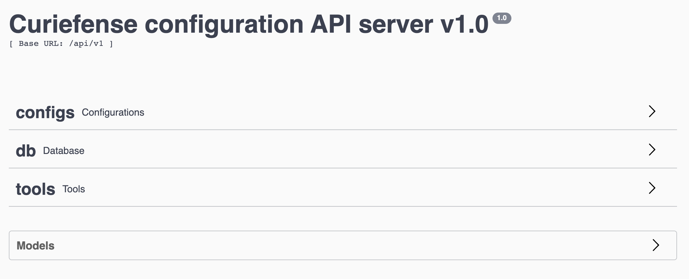
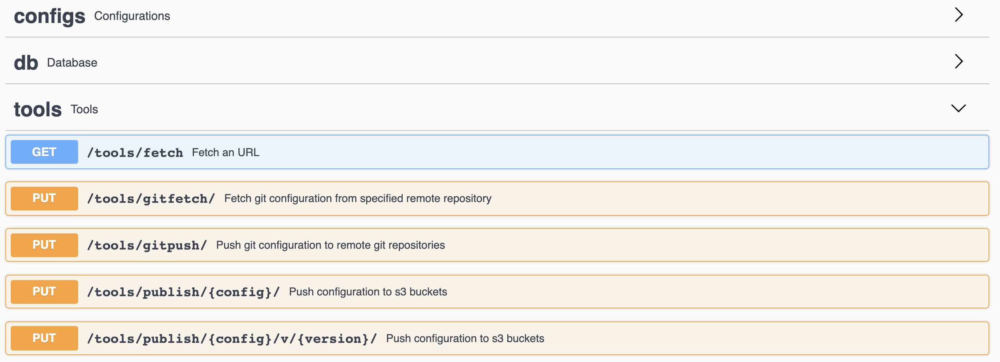
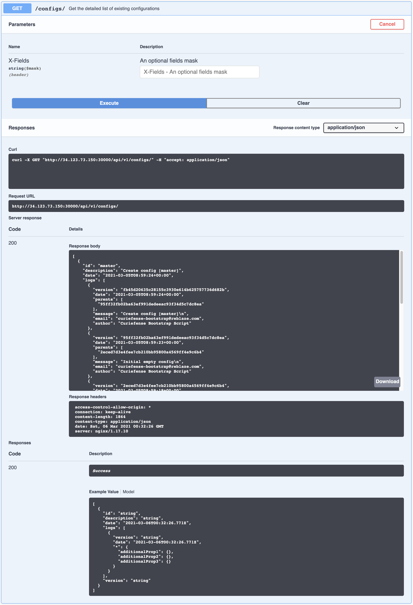
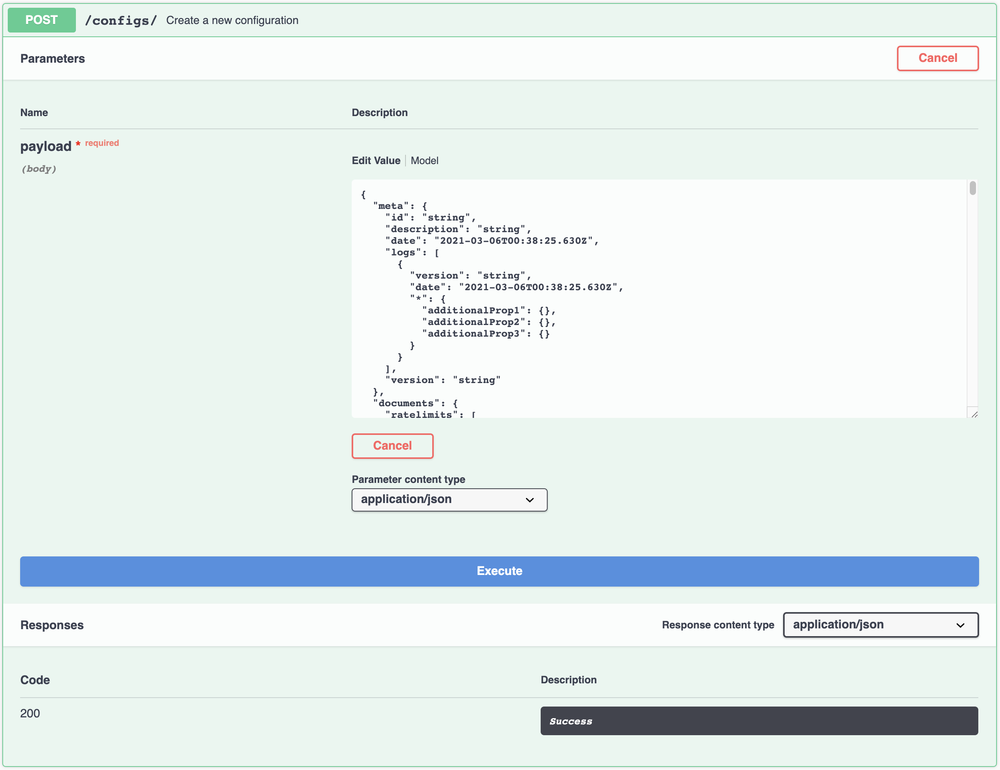

# API

## Introduction

Selecting the API option in the left sidebar will open the window shown above (by default, at [http://localhost:30000/api/v1](http://localhost:30000/api/v1)).

This displays the API visually using [Swagger](https://swagger.io). For production use, [curl](https://curl.se) can be used; sample curl calls for the various endpoints are available within Swagger.

## Data Structures

As discussed [here](../../#data-structures), Curiefense's data is stored within:

* Configurations
* Documents
* Entries
* Blobs

A Configuration is a set of Blobs and Documents. A Document is a set of Entries. 

All of these data structures can be edited via API:

* A Document is a file treated as a JSON list of entries.
* An entry is a JSON dictionary with an `id` field. The `id` field value must be unique inside the document, and must be a valid part of an URL.
* A Blob is a file treated as binary data.

### Versioning

Each time a Configuration is modified, a new version is created. A Configuration can be [reverted back to a previous version at any time](../../git/version-control.md).

## Namespaces

The Curiefense API has the following namespaces:

* **configs **(for manipulating Configurations)
* **db **(for accessing persistent key value storage)
* **tools **(for publishing, etc.)

## Endpoints

Each namespace contains various endpoints. For example, **tools** contains five:

## Exploring the API

Swagger is a useful way to experiment with the API. For example, selecting **configs** will display a list of endpoints. If you select this one:

... and then select the **Try it out **button, followed by the **Execute **button, this will be the result:

This allows you to interact with the API, try different commands, and see what responses will be generated.

## Using curl

As shown in the example above, Swagger will include sample curl commands for each namespace and endpoint. The commands can be copied and pasted for use elsewhere.

## API arguments

For some endpoints, arguments need to be supplied. Swagger will create defaults/samples, and provide input controls for them, as in this example: 

Here a sample payload has been created, and is being displayed for editing. After it is edited, selecting the **Execute** button will display the responses that are generated.

##

