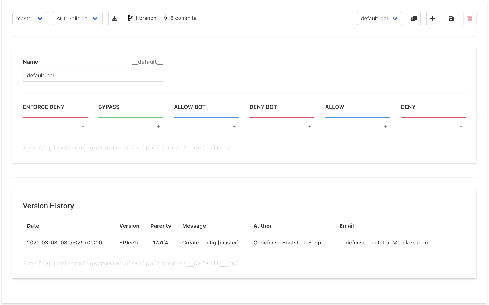
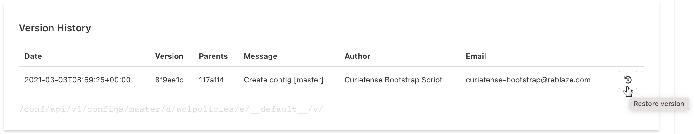

# Policies & Rules

Curiefense maintains its security parameters in Documents, which contain Entries. \(Read more about [Curiefense's data structures](../../#data-structures).\)

The Policies & Rules section is where Documents and their Entries are created, defined, and administered via the UI.

## Documents and traffic flow

Curiefense processes incoming requests according to this traffic flow:

* Each incoming request is inspected, and tags are assigned to it. For example, if the request's IP was found on the Spamhaus DROP list, it could be assigned a "spamhaus" tag. Some tags are generated automatically, while others are user-defined. \([Read more about tags](../../reference/tags.md).\)
* Next, Rate Limits are enforced. 
* Then, Session Flow Control is enforced.
* Next, Curiefense determines the security ruleset\(s\) that have been assigned to the request's target URL, and which match the tags. For example, there might be a ruleset defined for the "spamhaus" tag, or for the "devops" tag.
* Curiefense then enforces the ruleset\(s\), and takes the defined Action\(s\). For example, "block requests from Spamhaus-listed IPs", or "bypass devops requests from further filtering."

This process is based on the Documents as follows:

* \*\*\*\*[**Tag Rules** ](global-filters.md)is the Document which defines tags for external lists and custom lists.
* \*\*\*\*[**Rate Limits**](rate-limits.md) and [**Flow Control Policies**](flow-control.md) parameters define session-based policies.
* \*\*\*\*[**ACL Policies**](acl-profiles.md) ****and [**WAF Policies**](waf-policies.md) define the actions to take when specific tags and/or other criteria are observed. [**Security Policies**](security-policies.md) assign these actions to internal URLs.

## Policies & Rules interface

This page is divided into three vertical sections. From top to bottom, they are:

* Administration
* Entry editing
* Versioning

Each is discussed below.


After editing anything on this page, you must save your changes \(with the Save button on the upper right\) and then [publish them](../publish-changes.md).


## Entry Administration

The top section contains a toolbar with input controls. On the left, there are these: 

* **Configuration** pulldown: Selects the branch/configuration for editing.
* **Document** pulldown: Selects the Document to display for editing.
* **Download** button: Downloads the currently displayed parameters.

On the right are these:

* **Entry** pulldown: Selects the Entry \(the ruleset\) that is being displayed for editing.
* **Duplicate** button: Makes a copy of the currently displayed Entry.
* **Add** button: Creates a new Entry of the currently selected type.
* **Save** button: Saves all changes that were made since the last Save action.
* **Delete** button. Deletes the currently selected Entry.

## Entry Editing

The UI in this section will vary, depending on the type of Document being edited. Each is discussed in more depth here:

* [ACL Policies](acl-profiles.md)
* [Flow Control Policies](flow-control.md)
* [Global Filters](global-filters.md)
* [Rate Limits](rate-limits.md)
* [Security Plicies](security-policies.md)
* [WAF Policies](waf-policies.md)
* [WAF Rules](waf-rules.md)

At the bottom of this section, the URL of the current entry is shown in gray. It reflects the structure of the data. 

For example, `/conf/api/v1/configs/devops/d/urlmaps/e/__default__` shows that:

* The current Configuration \(or branch\) is devops.
* The current Document is urlmaps.
* The current Entry is \_\_default\_\_.

## **Document Versioning**

The bottom section of this page shows a history of versions for this Document. 

To revert this Document to a previous version, hover the cursor over the end of its listing. As shown above, a button will appear; selecting it will restore that version. 

Reversions are also available in the API and in the [Publish Configuration](../publish-changes.md) section of the UI.

