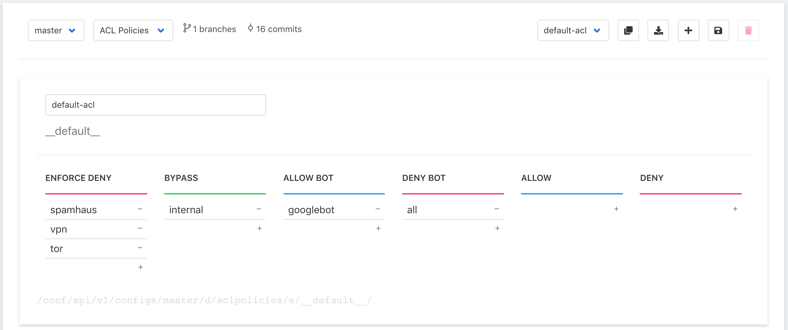
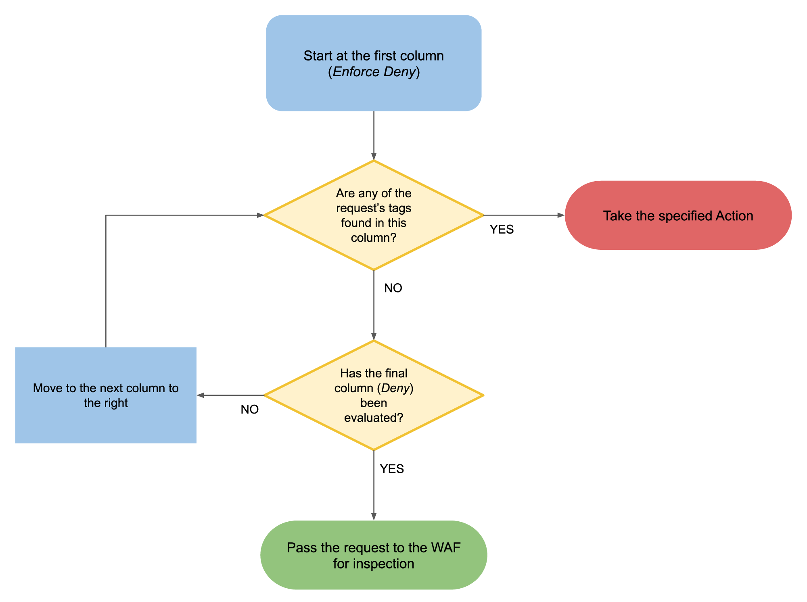

# ACL Policies

An ACL \(Access Control List\) Policy is a set of sequential criteria by which a request is evaluated. The input controls at the top of this page are described here: [Policies & Rules interface](./#document-editor-interface). Specific editing of an ACL Policy is described below.


This page defines ACL Policies. The Policies are assigned to URLs within the web application via [URL Maps](url-maps.md).



Out of the box, Curiefense includes a default ACL Policy. It can \(and usually should\) be edited, but it cannot be deleted. It is used for all URLs where no other Policy has been assigned.


The top part of the interface shows the ACL Policy that is currently being edited. Each Policy consists of one or more [tags](../../reference/tags.md). Each tag is listed under the action which will be triggered when a request matches that particular tag. 

In the interface, the tags are listed below their associated actions. Evaluation is performed from left to right:

* The incoming request is evaluated to see if it matches any of the tags in the far left column. 
* If a match is found, that column's action is performed, and no further evaluation is done. 
* If a match is not found, then the next column to the right is evaluated. A match will trigger that column's action; otherwise the next column is evaluated.
* This process continues until an action is taken or all columns have been evaluated.
* If a request does not match any tags in this Policy, it is passed to the WAF for further inspection.

## Action columns

| Action | Comment |
| :--- | :--- |
| **Enforce Deny** | Blocks the request. This is a useful way to quickly filter out, with minimal computing overhead, large numbers of requests that are obviously hostile or otherwise unwanted. |
| **Bypass** | Allows the request, and bypasses/exempts it from subsequent evaluation by the WAF. |
| **Allow Bot** | Passes the request to the WAF for further inspection without triggering a bot [challenge](../../reference/the-challenge-process.md) \(the process by which non-human traffic is identified and blocked\). An example usage is to allow search engine spiders.  |
| **Deny Bot** | If the requestor has not previously been verified to be human, a bot challenge will be issued. If the challenge is passed, the request will continue in the evaluation process. Otherwise the request is blocked. A common use of this column is to add the "all" tag, which means to identify and block all bots that weren't previously Allowed or Bypassed. |
| **Allow** | Passes the request to the WAF for further inspection. |
| **Deny** | Blocks the request. |


**Be very cautious when adding the "all" tag to an action column.** In most situations, that action will be taken for _all_ requests for which a match was not found in any columns to the left. 

The most common use is the "Deny Bot" column, as noted above. This means that all requestors \(except for those previously Allowed or Bypassed\) will be [challenged](../../reference/the-challenge-process.md) and verified to be humans.

Another possible use is to place "all" in the _Deny_ column, to create a positive security model. \(This will block all requests which did not explicitly meet any of the conditions to be _Bypassed_ or _Allowed_.\) But even this usage can be dangerous. Unless all the conditions for _Bypassing_ or _Allowing_ requests are fully and correctly defined, this can result in False Positive errors, and some legitimate requests will be blocked and filtered.

In other columns, "all" can have serious consequences. For example, placing it in the _Enforce Deny_ column will block _all_ incoming traffic to which this ACL Policy is applied. On the other hand, placing it in the _Bypass_ column will _allow_ all incoming traffic \(and exempt it from being scrubbed by the WAF!\), except for those requests which matched a tag in the _Enforce Deny_ column. 

Summary: before using the "all" tag in an ACL Policy, carefully consider its ramifications.


