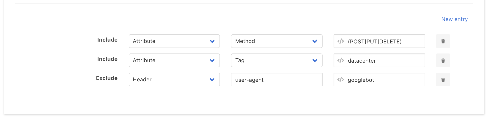

# Rate Limits

Rate Limits are rules which define the number of requests with certain characteristics that are allowed within defined time frames. When a request is received that exceeds a Rate Limit, a specified action is performed.

The input controls at the top of this page are described here: [Policies & Rules Entry Administration](./#entry-administration). Specific editing of a Rate Limit is described below.

## Rate Limit concepts

A Rate Limit defines the number of times that requests can match certain conditions within a certain time frame. Once that limit has been reached, subsequent requests matching those conditions within the same time frame will trigger an action.

The matching conditions are specified with the parameters in the "Count by" section and the optional Event. See **Matching Conditions** below. 


After a Rate Limit is defined on this page, it will not be active until it is assigned to one or more URLs. This is done in the [URL Maps](url-maps.md) Document.


By default, a Rate Limit will be enforced for all requests for the URL\(s\) to which it is assigned.

Enforcement can be further limited to a subset of these requests: see **Limiting the scope of a Rate Limit** below.

##  Meta Parameters

| Field | Value |
| :--- | :--- |
| **Name** | A name that will be used within the Curiefense interface, and will also be used to create a tag that will be assigned to requests which trigger the Rate Limit. It is recommended that the name summarizes the rule; for example, a rule with a Threshold of 5 and a TTL of 60 could be named "Rate limit rule 5/60".  |
| **Description** | A description that will be used within the Curiefense interface. |

## Rate Limit

| Field | Value |
| :--- | :--- |
| **Threshold** | The maximum number of allowable requests within the specified TTL. Subsequent requests within the TTL will trigger the Action.  |
| **TTL** | Time to Live: the period \(specified in seconds\) within which the Threshold is enforced.  |

## Matching Conditions \(the "Count by" input controls\)

A condition consists of a field and a value. Within a Rate Limit, they play a role like this:

"More than &lt;THRESHOLD&gt; requests with the same &lt;CONDITION-VALUE&gt; &lt;CONDITION-FIELD&gt; sent to &lt;ASSIGNED-LOCATION&gt; within &lt;TTL-PERIOD&gt; will cause &lt;ACTION&gt;."


**Example**: "More than three requests with the same username argument sent to the login form within one hour will cause the requestor to be banned for six hours."



Note that the &lt;ASSIGNED-LOCATION&gt; mentioned above is included for illustration purposes only. This value is not part of a Rate Limit definition—it is defined in a [URL Map](url-maps.md).


### Condition Definition

A condition can be built upon any one of these four categories:

| Field | Result |
| :--- | :--- |
| **Header** | All requests with the same value for the specified header will be counted together toward the Threshold. |
| **Cookie** | All requests with the same value for the specified cookie will be counted together toward the Threshold. |
| **Argument** | All requests with the same value for the specified argument will be counted together toward the Threshold. |
| **Attribute** | All requests with the same value for the specified attribute will be counted together toward the Threshold. |

### Multiple Conditions

Multiple conditions can be defined within the same Rate Limit. To create a new condition and open it for editing, select "**New entry**" below the list of conditions.

If multiple conditions are defined, they are evaluated by combining them together with a logical AND. In other words, the cumulative count toward the Threshold will be incremented whenever a request is seen that matches all of the conditions simultaneously. Different combinations of conditions will have separate Threshold counts maintained for them.


**Example**. A Rule contains two conditions: "Attribute / Remote Address" and "Argument / Username". When the first request is received, an internal counter is created \(set to a value of one\) for this unique combination of Remote Address and Username. A second request is then received, originating from the same Remote Address and for the same Username; this causes the internal counter to be incremented up to two. A third request is then received from the same Remote Address but with a different Username; this causes a new internal counter to be created \(and set to a value of one\) for this combination.


### The "Event" option: Changing the meaning of the Rate Limit

Below the list of condition\(s\), there is another condition named "**Event**." 

By default, this is set to "HTTP request,", which simply means to increment a counter each time a request is received that matches the conditions.

However, if the Event condition is changed to a different value, then the following applies.


In the discussion below, **"Count Condition"** will refer to the condition \(or combination of conditions\) defined by the **Count by** input controls.

**"Event Condition"** will refer to the optional, additional condition defined by the **Event** input controls.


**Adding an Event Condition changes the evaluation process.** An Event Condition is not logically combined with the preceding Count Condition; it is always evaluated separately.

More importantly, adding an Event Condition **changes the meaning of the Rate Limit**. 

* If an Event Condition is _not_ defined—in other words, if "HTTP request" is selected—then as discussed above, an internal counter is maintained for each Count Condition value, and incremented each time that value is encountered in a request.
* If an Event Condition _is_ defined—in other words, if something other than "HTTP request" is selected—an internal counter is maintained for each Count Condition Value, and incremented each time a _new, previously unobserved_ Event Condition value is encountered in a request.

Therefore, if an Event Condition is defined, the Rate Limit constrains the _number of allowable Event Condition values for any given Count Condition value_. 

So, the evaluation becomes something like this:

 "More than &lt;THRESHOLD&gt; &lt;EVENT-CONDITION-VALUE&gt; &lt;EVENT-CONDITION-FIELD&gt;s per any one &lt;COUNT-CONDITION-VALUE&gt;&lt;COUNT-CONDITION-FIELD&gt; sent to &lt;ASSIGNED-LOCATION&gt; within &lt;TTL-PERIOD&gt; will cause &lt;ACTION&gt;."

Note that the number of Count Condition values is not being limited here. The limit is on the number of Event Condition values that each Count Condition value is allowed.


**Example**: Let's say we want to allow an individual user to login from a maximum of two ASNs within one hour. \(Perhaps the user is accessing our web application from a coffee shop's WiFi, and then a few minutes later, leaves the coffee shop and begins using the cell network instead.\) We want to allow this possibility; however, if we receive requests from the same user originating from three or more ASNs within an hour, we want to treat this traffic more suspiciously.   
  
This is not possible merely by specifying two Count Conditions, as described earlier in the "Multiple Conditions" section. If we set up two conditions \("Argument / Username" and "Attribute / Organization"\) with a Threshold of 2, and assign it to our login form, then this will merely limit the number of times that the user can login from _each_ ASN within an hour.   
  
Instead, we can set up one Count Condition \("Argument / Username"\) and then set up the Event Condition \("Attribute / Organization"\). Now the Threshold will apply to the number of Organizations that are observed for each specific Username.


## Action

When an incoming request exceeds the Threshold, the Action specified here will occur.

| Action | Meaning |
| :--- | :--- |
| **503 Service Unavailable** | The request will be blocked and the requestor will receive a response of "503 Service Unavailable". |
| **Challenge** | For a browser-based web application, a [bot challenge](../../reference/the-challenge-process.md) will be issued to verify that the requestor is a human using a browser, and not a bot using a headless browser or emulator. If the challenge is failed, the request is blocked. |
| **Tag Only** | The request will not be blocked; it will merely be tagged with the Rate Limit's name, for subsequent viewing in the [Access Log](../../analytics/access-log.md) and other places. This Action is useful for testing new Rate Limit rules without actually affecting incoming traffic.  |
| **Response** | Blocks the request, and responds with a custom error code \(0-999\) and response body.  |
| **Redirect** | Blocks the request with a custom error code, and redirects the requestor to a specified URL. For example, the URL might be a page that says, "Your activity appears suspicious, and your access has been restricted. Contact support if you think this decision was made in error." |
| **Ban** | Blocks the requestor for the specified amount of time. See further discussion below. |
| **Header** | Does not block the request, but adds headers to it \(indicating the Rate Limit rule name and the threshold\) for receipt and evaluation by the user's backend. |

### The Ban action

Most of the Actions listed above will not fully exclude an attacker that continues pressing the attack. 


**Example**: Access to a login form is rate-limited to three requests per minute. An attacker tries to brute-force the login, and sends 60 requests per minute. The Rate Limit allows the first three requests, but then blocks the next 57 requests with a 503 error.   
  
However, after the minute has passed, the Rate Limit resets. The attacker is allowed another three attempts before being temporarily blocked again. This cycle can continue for as long as the attacker wishes. In effect, the Rate Limit is not preventing the attack; it is merely slowing it from 60 attempts per minute down to three attempts per minute.


The Ban action can be used to block \(or take some other Action in response to\) a Rate Limit violator for an extended period of time. 


**Example**: As described above, a Rate Limit is created to allow three requests per minute, with an Action of _503 Service Unavailable_.  
  
However, an additional Rate Limit rule is also defined: nine requests per three minutes, with an Action of _Ban_. The Ban has an Action of _503 Service Unavailable,_ and a duration of one hour.  
  
[URL Maps](url-maps.md) allow for multiple Rate Limits to be assigned to a single URL. Thus, both of the above rules can be assigned to the login form.  
  
Now an attacker tries to brute-force the login form, sending 60 requests per minute. The first three requests are allowed. The next six requests are blocked \(and a 503 error is issued\) by the first Rate Limit.   
  
The tenth request triggers the second Rate Limit, and the Ban occurs. For the next hour, the attacker's requests will be blocked with a 503 error.



**Second example:** A hostile bot receives a [bot challenge](../../reference/the-challenge-process.md), which it fails. Curiefense will block the request. If the bot keeps re-submitting its request, it will continue to fail the challenges. However, each time the bot tries again, Curiefense has to issue a new challenge .  
  
To solve this problem, a second Rate Limit is created with a Ban action. Now a persistent bot will simply be Banned, saving Curiefense the overhead of issuing continuous challenges.


Note that when setting up a Ban, the most common choices for its Action are to deny the violator's requests \(via _503 Service Unavailable_, _Response_, or _Redirect_\). However, you can also choose _Tag Only_ \(to observe the violator's actions during the ban period\), _Challenge_ \(to verify that the violating activity is not being done by bots\), or _Header_ \(to mark the requests for further scrutiny by the backend\).

## Limiting the scope of a Rate Limit

By default, an active Rate Limit rule will be enforced upon all incoming requests targeting URLs to which this rule has been assigned.

To change this behavior, you can add **Include** and/or **Exclude** parameters. These define the portion of the incoming traffic stream that will be evaluated for possible violation of the Rate Limit. In other words, they limit the scope of the Rate Limit's enforcement: 

* The Include filter will limit enforcement to requests matching its parameters. All other requests in the traffic stream will not have this Rate Limit enforced upon them.
* The Exclude filter will exempt requests from enforcement that otherwise would have been subject to it.

\(Internally, Curiefense evaluates Exclude parameters first, and then Include parameters.\)

To add one or more filters, select **New entry**, define the parameters, then select the "**+**" button. If more than one Include filter is specified, they are combined with a logical AND.

