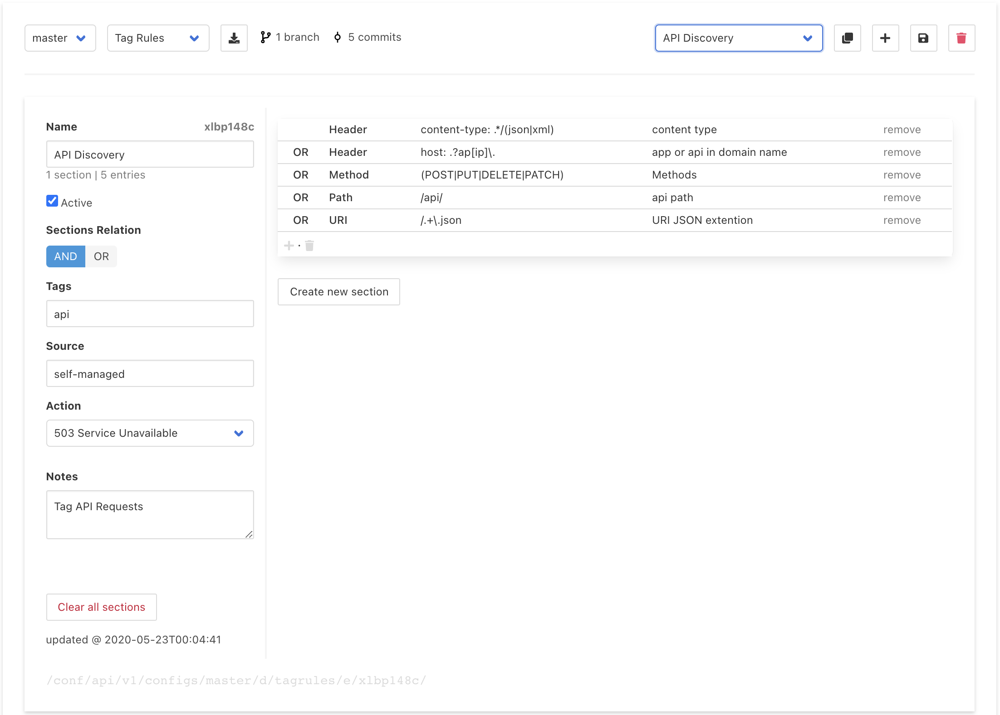
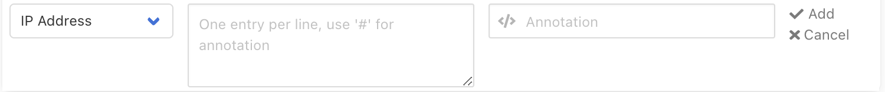
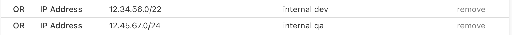

# Tag Rules

The input controls at the top of this page are described here: [Policies & Rules](./#document-editor-interface)[ interface](./#document-editor-interface). Specific editing of a Tag Rules List is described below.

## Overview

Early in the [traffic evaluation process](../../reference/multi-stage-traffic-filtering.md), Curiefense assigns **Tags** to an incoming request. Subsequently, the Tags can be used to make decisions about how the request is processed. After processing, a request's Tags remain associated with it, and they are available for display in the [Access Log](../../analytics/access-log.md).

This page allows you to administer **Tag Rule Lists**, which are combinations of [user-defined Tags](../../reference/tags.md#user-defined-tags) and the criteria for assigning them to requests. 


The actions that can be performed as a result of the Tag assignments are administered separately in [ACL Policies](acl-policies.md) and [Rate Limits](rate-limits.md).


Each Tag Rule List consists of:

* **Match conditions**: Definitions of possible characteristics that a request can match \(e.g., a list of IP addresses that it might originate from\), plus one or more logical operators to use when evaluating the match.
* **One or more Tags to assign** when a match occurs. 
* **An Action** to apply to the request.

For each incoming request, Curiefense will evaluate all active Tag Rule Lists. A single request will receive Tags from all Lists which match it.

## Metadata

| Field | Meaning |
| :--- | :--- |
| **Name** | A description that will be displayed within the Curiefense interface. |
| **Active** | By default, the Tag Rule List will be applied to incoming requests. To prevent this, unselect the checkbox. |
| **Sections Relation** | For Lists with multiple sections, this is the logical relation to use when evaluating the Match Conditions in the sections. |
| **Tags** | One or more Tags \(separated by spaces\) that will be assigned to requests if the match conditions are fulfilled. Example: `internal team-devops`. |
| **Source** | The source of the match conditions. See discussion below. |
| **Action** | The action to take for requests that match the criteria in this list. By default, this is **Tag Only**; the specified tag\(s\) will be applied, and the traffic evaluation process will continue. If instead the Match Conditions describe a request for which the final disposition is already known, then there is no need for the complete evaluation process to occur. In this situation, the Action can be set here, and it will be applied immediately whenever a request meets the Match Conditions. |
| **Notes** | An optional field for including additional information. |

### Source

Tag Rule Lists can be either Internet-sourced or self-managed.

* **Internet-sourced** Lists are based upon online sources \(e.g., Spamhaus DROP lists\). To use an Internet-sourced list, enter its URL into the **Source** field. For example, to create a list based on the Spamhaus ASN DROP list, you would enter [https://www.spamhaus.org/drop/asndrop.txt](https://www.spamhaus.org/drop/asndrop.txt) and select the **update now** control that will appear. Curiefense will then populate the list automatically. 
* **Self-managed** Lists are created manually. The Source field entry will be `self-managed`.

Note that Internet-sourced lists are not editable within the interface, because they are obtained automatically; Curiefense updates them every 24 hours \(or you can force an immediate update by selecting **update now**\). Typically, these will be Single-Section Lists.

## Specifying Match Conditions

Match conditions are lists of criteria and the logical operators \(AND or OR\) to use when evaluating them. 

Match conditions are combined into sections. An additional logical operator defines the relationship between each section. 

## Single-Section Lists

Many Tag Rules Lists will have only section. Here's an example. 

In the example, the **Sections relation** toggle is set to `AND`. For a single-section list, this toggle is ignored.

Within each section, there is an additional logical operator, shown at the beginning of each list entry after the first. This is used when evaluating the criteria within the list: 

* `OR` means the **Tags** will be attached to, and the **Action** taken for, each request that matches any of the entries in the list. 
* `AND` means the **Tags** will only be attached to, and the **Action** taken for, requests that match all of the entries in the list.

This operator can be toggled by selecting it.

### Adding a Match Condition

To add a match condition, select the add control \("**+**"\) at the bottom of the list. The following dialog will appear.

For most of the categories \(IP Address, Method, etc.\), the dialog will appear as it is above. Multiple entries can be made at once, with each entry on a separate line. Each line contains the value, plus a pound sign \(\#\) followed by an **annotation** \(a label for display within the Curiefense interface\). Example:

The entries will then be added as follows:

For some categories, one entry can be made at a time, with each entry requiring multiple lines. There are no annotations. 


Match criteria are case-insensitive.


Here are some sample entries for the various categories. Notice that boolean operators are available.

Once created, these entries cannot be edited. If one needs to be modified, remove it and re-create it.

## Multiple-Section Lists

Match conditions can be combined into multiple sections. To add a section to an existing Tag Rules List, select **Create new section**.

Here's an example:

Each additional section works the same as the initial section. Note that each section has its own **Entries relation** operator. 

However, a multiple-section list also includes a logical operator for the relationship\(s\) between the individual sections. In the example above, this is `AND`. Therefore, a request will receive the tag of `internal` if it matches any of the IPs in the first section, `AND` it also contains one of the HTTP methods specified in the second section. 

Note that the inter-section operator is shown in between the sections. To change the operator, select the toggle in the **Sections control** area on the left. 

