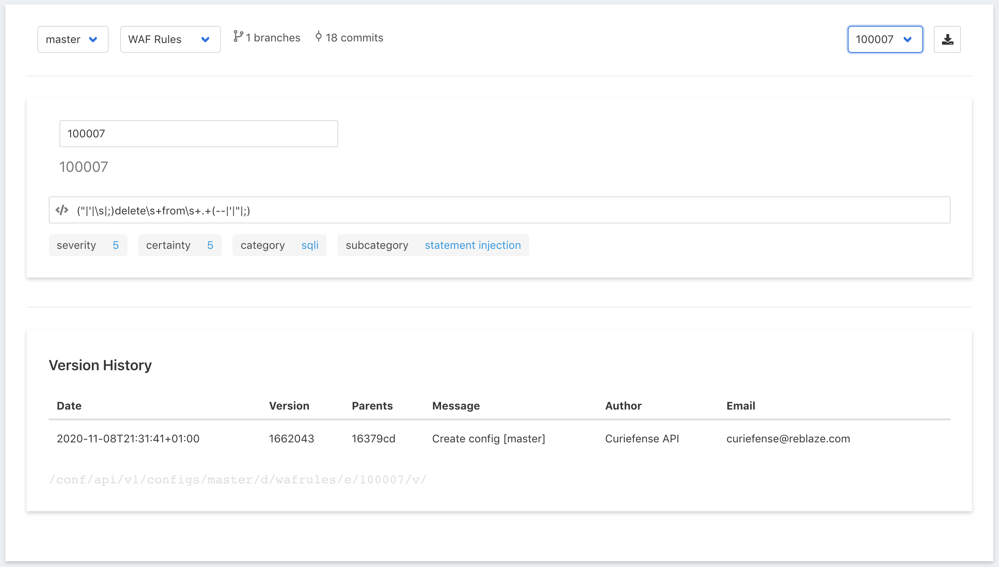

# WAF Rules

This section displays all the WAF Rules defined within Curiefense. This has various uses; for example, looking up the underlying signature for a tag that appears in the Access Log, or getting the ID of a Rule to exclude in a WAF Policy.

Curiefense comes with many WAF Rules. You can view them by choosing different IDs in the pulldown on the upper right.

Note that this list is for reference only. The entries cannot be edited. 

